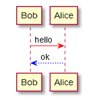
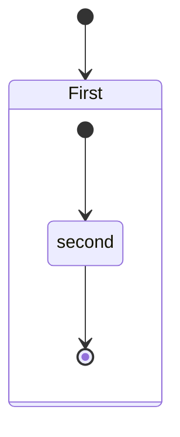
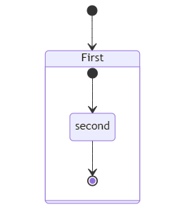

# Markdown PDF

この拡張機能は Markdown ファイルを pdf、html、png、jpeg ファイルに変換します。

## 目次
<!-- TOC depthFrom:2 depthTo:2 updateOnSave:false -->

- [仕様変更](#仕様変更)
- [機能](#機能)
- [インストール](#インストール)
- [使い方](#使い方)
- [拡張機能 設定](#拡張機能-設定)
- [オプション](#オプション)
- [FAQ](#faq)
- [既知の問題](#既知の問題)
- [Release Notes](#release-notes)
- [License](#license)
- [Special thanks](#special-thanks)

<!-- /TOC -->

<div class="page"/>

## 仕様変更

- PDFのヘッダーとフッターのデフォルトの日付書式変更
  - バージョン1.5.0から、ヘッダーとフッターのデフォルトの日付書式がISOベースの書式（YYYY-MM-DD）に変更されました。
  - この変更は、以前の書式が環境によって異なる可能性があったため、日付表示の一貫性を向上させることを目的としています。
  - 以前の書式を使用したい場合は、[markdown-pdf.headerTemplate](#markdown-pdfheadertemplate)を参照してください。

## 機能

以下の機能をサポートしています。
* [Syntax highlighting](https://highlightjs.org/static/demo/)
* [emoji](https://www.webfx.com/tools/emoji-cheat-sheet/)
* [markdown-it-checkbox](https://github.com/mcecot/markdown-it-checkbox)
* [markdown-it-container](https://github.com/markdown-it/markdown-it-container)
* [markdown-it-include](https://github.com/camelaissani/markdown-it-include)
* [PlantUML](https://plantuml.com/)
  * [markdown-it-plantuml](https://github.com/gmunguia/markdown-it-plantuml)
* [mermaid](https://mermaid-js.github.io/mermaid/)

サンプルファイル
 * [pdf](sample/README.pdf)
 * [html](sample/README.html)
 * [png](sample/README.png)
 * [jpeg](sample/README.jpeg)

### markdown-it-container

INPUT
```
::: warning
*here be dragons*
:::
```

OUTPUT
``` html
<div class="warning">
<p><em>here be dragons</em></p>
</div>
```

### markdown-it-plantuml

INPUT
```
@startuml
Bob -[#red]> Alice : hello
Alice -[#0000FF]->Bob : ok
@enduml
```

OUTPUT



### markdown-it-include

Include markdown fragment files: `:[alternate-text](relative-path-to-file.md)`.

```
├── [plugins]
│  └── README.md
├── CHANGELOG.md
└── README.md
```

INPUT
```
README Content

:[Plugins](./plugins/README.md)

:[Changelog](CHANGELOG.md)
```

OUTPUT
```
Content of README.md

Content of plugins/README.md

Content of CHANGELOG.md
```

### mermaid

INPUT
<pre>

</pre>

OUTPUT



## インストール

Markdown PDF をインストールして、Visual Studio Code で Markdownファイルを最初に開いた時、Chromium のダウンロードが自動で始まります。

しかしサイズが大きい為 (~170Mb Mac, ~282Mb Linux, ~280Mb Win) 、環境によっては時間がかかります。
ダウンロード中は、ステータスバーに `Installing Puppeteer` のメッセージが表示されます。

もしプロキシを使う必要がある場合、settings.json に `http.proxy` でプロキシを設定し、Visual Studio Code を再起動してください。

ダウンロードが上手くいかない場合や、Markdown PDF のバージョンアップの度にダウンロードするのを避けたい場合、[markdown-pdf.executablePath](#markdown-pdfexecutablepath) オプションでインストール済みの [Chrome](https://www.google.co.jp/chrome/) か Chromium を指定してください。

<div class="page"/>

## 使い方

### コマンド パレット

1. Markdown ファイルを開きます
1. `F1` キーを押すか、`Ctrl+Shift+P` キーを入力します
1. `export` と入力し以下を選択します
   * `markdown-pdf: Export (settings.json)`
   * `markdown-pdf: Export (pdf)`
   * `markdown-pdf: Export (html)`
   * `markdown-pdf: Export (png)`
   * `markdown-pdf: Export (jpeg)`
   * `markdown-pdf: Export (all: pdf, html, png, jpeg)`


### メニュー

1. Markdown ファイルを開きます
1. 右クリックして以下を選択します
   * `markdown-pdf: Export (settings.json)`
   * `markdown-pdf: Export (pdf)`
   * `markdown-pdf: Export (html)`
   * `markdown-pdf: Export (png)`
   * `markdown-pdf: Export (jpeg)`
   * `markdown-pdf: Export (all: pdf, html, png, jpeg)`


### 自動変換

1. **settings.json** に `"markdown-pdf.convertOnSave": true` オプションを追加します
1. Visual Studio Code を再起動します
1. Markdown ファイルを開きます
1. 保存すると自動で変換されます

## 拡張機能 設定

[Visual Studio Code User and Workspace Settings](https://code.visualstudio.com/docs/customization/userandworkspace)

1. メニューから **ファイル > 基本設定 > ユーザー設定 か ワークスペース設定** を選択します
1. **既定の設定** から markdown-pdf の設定を探します
1. `markdown-pdf.*` の設定をコピーします
1. **settings.json** に貼り付け、値を変更します


## オプション

### List

|Category|Option name|[Configuration scope](https://code.visualstudio.com/api/references/contribution-points#Configuration-property-schema)|
|:---|:---|:---|
|[Save options](#save-options)|[markdown-pdf.type](#markdown-pdftype)| |
||[markdown-pdf.convertOnSave](#markdown-pdfconvertonsave)| |
||[markdown-pdf.convertOnSaveExclude](#markdown-pdfconvertonsaveexclude)| |
||[markdown-pdf.outputDirectory](#markdown-pdfoutputdirectory)| |
||[markdown-pdf.outputDirectoryRelativePathFile](#markdown-pdfoutputdirectoryrelativepathfile)| |
|[Styles options](#styles-options)|[markdown-pdf.styles](#markdown-pdfstyles)| |
||[markdown-pdf.stylesRelativePathFile](#markdown-pdfstylesrelativepathfile)| |
||[markdown-pdf.includeDefaultStyles](#markdown-pdfincludedefaultstyles)| |
|[Syntax highlight options](#syntax-highlight-options)|[markdown-pdf.highlight](#markdown-pdfhighlight)| |
||[markdown-pdf.highlightStyle](#markdown-pdfhighlightstyle)| |
|[Markdown options](#markdown-options)|[markdown-pdf.breaks](#markdown-pdfbreaks)| |
|[Emoji options](#emoji-options)|[markdown-pdf.emoji](#markdown-pdfemoji)| |
|[Configuration options](#configuration-options)|[markdown-pdf.executablePath](#markdown-pdfexecutablepath)| |
|[Common Options](#common-options)|[markdown-pdf.scale](#markdown-pdfscale)| |
|[PDF options](#pdf-options)|[markdown-pdf.displayHeaderFooter](#markdown-pdfdisplayheaderfooter)|resource|
||[markdown-pdf.headerTemplate](#markdown-pdfheadertemplate)|resource|
||[markdown-pdf.footerTemplate](#markdown-pdffootertemplate)|resource|
||[markdown-pdf.printBackground](#markdown-pdfprintbackground)|resource|
||[markdown-pdf.orientation](#markdown-pdforientation)|resource|
||[markdown-pdf.pageRanges](#markdown-pdfpageranges)|resource|
||[markdown-pdf.format](#markdown-pdfformat)|resource|
||[markdown-pdf.width](#markdown-pdfwidth)|resource|
||[markdown-pdf.height](#markdown-pdfheight)|resource|
||[markdown-pdf.margin.top](#markdown-pdfmargintop)|resource|
||[markdown-pdf.margin.bottom](#markdown-pdfmarginbottom)|resource|
||[markdown-pdf.margin.right](#markdown-pdfmarginright)|resource|
||[markdown-pdf.margin.left](#markdown-pdfmarginleft)|resource|
|[PNG JPEG options](#png-jpeg-options)|[markdown-pdf.quality](#markdown-pdfquality)| |
||[markdown-pdf.clip.x](#markdown-pdfclipx)| |
||[markdown-pdf.clip.y](#markdown-pdfclipy)| |
||[markdown-pdf.clip.width](#markdown-pdfclipwidth)| |
||[markdown-pdf.clip.height](#markdown-pdfclipheight)| |
||[markdown-pdf.omitBackground](#markdown-pdfomitbackground)| |
|[PlantUML options](#plantuml-options)|[markdown-pdf.plantumlOpenMarker](#markdown-pdfplantumlopenmarker)| |
||[markdown-pdf.plantumlCloseMarker](#markdown-pdfplantumlclosemarker)| |
||[markdown-pdf.plantumlServer](#markdown-pdfplantumlserver)| |
|[markdown-it-include options](#markdown-it-include-options)|[markdown-pdf.markdown-it-include.enable](#markdown-pdfmarkdown-it-includeenable)| |
|[mermaid options](#mermaid-options)|[markdown-pdf.mermaidServer](#markdown-pdfmermaidserver)| |

### Save options

#### `markdown-pdf.type`
  - 出力フォーマット: pdf, html, png, jpeg
  - 複数の出力フォーマットをサポート
  - Default: pdf

```javascript
"markdown-pdf.type": [
  "pdf",
  "html",
  "png",
  "jpeg"
],
```

#### `markdown-pdf.convertOnSave`
  - 保存時の自動変換を有効にします
  - boolean. Default: false
  - 設定の反映には、Visutal Studio Code の再起動が必要です

#### `markdown-pdf.convertOnSaveExclude`
  - convertOnSave オプションの除外ファイル名を指定します

```javascript
"markdown-pdf.convertOnSaveExclude": [
  "^work",
  "work.md$",
  "work|test",
  "[0-9][0-9][0-9][0-9]-work",
  "work\\test"  // 全ての \ は \\ と記述する必要があります。(Windows)
],
```
#### `markdown-pdf.outputDirectory`
  - 出力ディレクトリを指定します
  - 全ての `\` は `\\` と記述する必要があります (Windows)

```javascript
"markdown-pdf.outputDirectory": "C:\\work\\output",
```

  - 相対パス
    - `Markdownファイル` を開いた場合、ファイルからの相対パスとして解釈されます
    - `フォルダ` を開いた場合、ルートフォルダからの相対パスとして解釈されます
    - `ワークスペース` を開いた場合、それぞれのルートフォルダからの相対パスとして解釈されます
      - [マルチルート ワークスペース](https://code.visualstudio.com/docs/editor/multi-root-workspaces) を参照してください

```javascript
"markdown-pdf.outputDirectory": "output",
```

  - 相対パス (ホームディレクトリ)
    - パスが `^` で始まっている場合、ホームディレクトリからの相対パスとして解釈されます

```javascript
"markdown-pdf.outputDirectory": "~/output",
```

  - `相対パス`でディレクトリを設定した場合、ディレクトリが存在しなければ作成されます
  - `絶対パス`でディレクトリを設定した場合、ディレクトリが存在しなければエラーになります

#### `markdown-pdf.outputDirectoryRelativePathFile`
  - `markdown-pdf.outputDirectoryRelativePathFile` オプションが `true` に設定されている場合、[markdown-pdf.outputDirectory](#markdown-pdfoutputDirectory) で設定した相対パスは、ファイルからの相対パスとして解釈されます
  - フォルダやワークスペースからの相対パスを避けたい場合に使うことが出来ます
  - boolean. Default: false

### Styles options

#### `markdown-pdf.styles`
  - markdown-pdf で使用するスタイルシートのパスを指定します
  - ファイルが存在しない場合、スキップされます
  - 全ての `\` は `\\` と記述する必要があります (Windows)

```javascript
"markdown-pdf.styles": [
  "C:\\Users\\<USERNAME>\\Documents\\markdown-pdf.css",
  "/home/<USERNAME>/settings/markdown-pdf.css",
],
```

  - 相対パス
    - `Markdownファイル` を開いた場合、ファイルからの相対パスとして解釈されます
    - `フォルダ` を開いた場合、ルートフォルダからの相対パスとして解釈されます
    - `ワークスペース` を開いた場合、それぞれのルートフォルダからの相対パスとして解釈されます
      - [マルチルート ワークスペース](https://code.visualstudio.com/docs/editor/multi-root-workspaces) を参照してください

```javascript
"markdown-pdf.styles": [
  "markdown-pdf.css",
],
```

  - 相対パス (ホームディレクトリ)
    - パスが `^` で始まっている場合、ホームディレクトリからの相対パスとして解釈されます

```javascript
"markdown-pdf.styles": [
  "~/.config/Code/User/markdown-pdf.css"
],
```

  - オンラインCSS (https://xxx/xxx.css) は JPG と PNG では正しく適用されますが、PDF では問題が発生します [#67](https://github.com/yzane/vscode-markdown-pdf/issues/67)

```javascript
"markdown-pdf.styles": [
  "https://xxx/markdown-pdf.css"
],
```

#### `markdown-pdf.stylesRelativePathFile`
  - `markdown-pdf.stylesRelativePathFile` オプションが `true` に設定されている場合、[markdown-pdf.styles](#markdown-pdfstyles) で設定した相対パスは、ファイルからの相対パスとして解釈されます
  - フォルダやワークスペースからの相対パスを避けたい場合に使うことが出来ます
  - boolean. Default: false

#### `markdown-pdf.includeDefaultStyles`
  - デフォルトのスタイルシート(VSCode, markdown-pdf)を有効にします
  - boolean. Default: true

### Syntax highlight options

#### `markdown-pdf.highlight`
  - Syntax highlighting を有効にします
  - boolean. Default: true

#### `markdown-pdf.highlightStyle`
  - スタイルシートのファイル名を指定します。例: github.css, monokai.css ...
  - [ファイル名のリスト](https://github.com/isagalaev/highlight.js/tree/master/src/styles)
  - [highlight.js demo](https://highlightjs.org/static/demo/)

```javascript
"markdown-pdf.highlightStyle": "github.css",
```

### Markdown options

#### `markdown-pdf.breaks`
  - 改行を有効にします
  - boolean. Default: false

### Emoji options

#### `markdown-pdf.emoji`
  - 絵文字を有効にします [EMOJI CHEAT SHEET](https://www.webpagefx.com/tools/emoji-cheat-sheet/)
  - boolean. Default: true

### Configuration options

#### `markdown-pdf.executablePath`
  - バンドルされた Chromium の代わりに実行する Chromium または Chrome のパスを指定します
  - 全ての `\` は `\\` と記述する必要があります (Windows)
  - 設定の反映には、Visutal Studio Code の再起動が必要です

```javascript
"markdown-pdf.executablePath": "C:\\Program Files (x86)\\Google\\Chrome\\Application\\chrome.exe"
```

### Common Options

#### `markdown-pdf.scale`
  - ページレンダリングのスケール
  - number. default: 1

```javascript
"markdown-pdf.scale": 1
```

### PDF options

  - pdf only. [puppeteer page.pdf options](https://github.com/puppeteer/puppeteer/blob/main/docs/api/puppeteer.pdfoptions.md)

#### `markdown-pdf.displayHeaderFooter`
  - ヘッダーとフッター表示を有効にします
  - boolean. Default: true
  - このオプションを有効にすると、ヘッダーとフッターが両方表示されます
  - 片方を表示したくない場合は、もう片方の値を削除します
  - ヘッダー非表示
    ```javascript
    "markdown-pdf.headerTemplate": "",
    ```
  - フッター非表示
    ```javascript
    "markdown-pdf.footerTemplate": "",
    ```

#### `markdown-pdf.headerTemplate`
  - ヘッダーを出力する為のHTMLテンプレートを指定します
  - このオプションを使用するには、`markdown-pdf.displayHeaderFooter` を `true` に設定する必要があります。
  - `<span class='date'></span>` : 日付。フォーマットは環境に依存します
  - `<span class='title'></span>` : Markdown ファイル名
  - `<span class='url'></span>` : Markdown フルパスファイル名
  - `<span class='pageNumber'></span>` : 現在のページ番号
  - `<span class='totalPages'></span>` : ドキュメントの総ページ数
  - `%%ISO-DATETIME%%` : 現在の日付と時刻。ISOベース フォーマット (`YYYY-MM-DD hh:mm:ss`)
  - `%%ISO-DATE%%` : 現在の日付。ISOベース フォーマット (`YYYY-MM-DD`)
  - `%%ISO-TIME%%` : 現在の時刻。ISOベース フォーマット (`hh:mm:ss`)
  - Default (version1.5.0以降): Markdown ファイル名 と 日付を `%%ISO-DATE%%` で表示します
    ```javascript
    "markdown-pdf.headerTemplate": "<div style=\"font-size: 9px; margin-left: 1cm;\"> <span class='title'></span></div> <div style=\"font-size: 9px; margin-left: auto; margin-right: 1cm; \">%%ISO-DATE%%</div>",
    ```
  - Default (version1.4.4以前): Markdown ファイル名 と 日付を `<span class='date'></span>` で表示します
    ```javascript
    "markdown-pdf.headerTemplate": "<div style=\"font-size: 9px; margin-left: 1cm;\"> <span class='title'></span></div> <div style=\"font-size: 9px; margin-left: auto; margin-right: 1cm; \"> <span class='date'></span></div>",
    ```
#### `markdown-pdf.footerTemplate`
  - フッターを出力する為のHTMLテンプレートを指定します
  - 詳細は、[markdown-pdf.headerTemplate](#markdown-pdfheadertemplate) を参照してください
  - Default: {現在のページ番号} / {ドキュメントの総ページ数} を表示します
    ```javascript
    "markdown-pdf.footerTemplate": "<div style=\"font-size: 9px; margin: 0 auto;\"> <span class='pageNumber'></span> / <span class='totalPages'></span></div>",
    ```

#### `markdown-pdf.printBackground`
  - 背景のグラフィックを出力
  - boolean. Default: true

#### `markdown-pdf.orientation`
  - ページの向き
  - portrait(縦向き) or landscape(横向き)
  - Default: portrait

#### `markdown-pdf.pageRanges`
  - 出力するページ範囲 例) '1-5, 8, 11-13'
  - Default: 全ページ

```javascript
"markdown-pdf.pageRanges": "1,4-",
```

#### `markdown-pdf.format`
  - 用紙のフォーマット
  - Letter, Legal, Tabloid, Ledger, A0, A1, A2, A3, A4, A5, A6
  - Default: A4

```javascript
"markdown-pdf.format": "A4",
```

#### `markdown-pdf.width`
#### `markdown-pdf.height`
  - 用紙の幅/高さ、 単位(mm, cm, in, px)
  - このオプションが指定されている場合、markdown-pdf.format オプションより優先されます

```javascript
"markdown-pdf.width": "10cm",
"markdown-pdf.height": "20cm",
```

#### `markdown-pdf.margin.top`
#### `markdown-pdf.margin.bottom`
#### `markdown-pdf.margin.right`
#### `markdown-pdf.margin.left`
  - 用紙の余白、単位(mm, cm, in, px)

```javascript
"markdown-pdf.margin.top": "1.5cm",
"markdown-pdf.margin.bottom": "1cm",
"markdown-pdf.margin.right": "1cm",
"markdown-pdf.margin.left": "1cm",
```

### PNG, JPEG options

  - png and jpeg only. [puppeteer page.screenshot options](https://github.com/GoogleChrome/puppeteer/blob/master/docs/api.md#pagescreenshotoptions)

#### `markdown-pdf.quality`
  - jpeg only. イメージの品質を 0-100 の範囲で指定します。 png では無効です。

```javascript
"markdown-pdf.quality": 100,
```

#### `markdown-pdf.clip.x`
#### `markdown-pdf.clip.y`
#### `markdown-pdf.clip.width`
#### `markdown-pdf.clip.height`
  - ページの切り抜き領域を指定します
  - number

```javascript
// 切り抜き領域のX軸の基点を指定します。ページの左上が原点です。
"markdown-pdf.clip.x": 0,

// 切り抜き領域のY軸の基点を指定します。ページの左上が原点です。
"markdown-pdf.clip.y": 0,

// 切り抜き領域の幅を指定します
"markdown-pdf.clip.width": 1000,

// 切り抜き領域の高さを指定します
"markdown-pdf.clip.height": 1000,
```

#### `markdown-pdf.omitBackground`
  - デフォルトの白い背景ではなく、透過によるスクリーンショットのキャプチャーを有効にします
  - boolean. Default: false

### PlantUML options

#### `markdown-pdf.plantumlOpenMarker`
  - plantuml パーサーの開始区切り文字
  - Default: @startuml

#### `markdown-pdf.plantumlCloseMarker`
  - plantuml パーサーの終了区切り文字
  - Default: @enduml

#### `markdown-pdf.plantumlServer`
  - Plantuml server. e.g. http://localhost:8080
  - Default: http://www.plantuml.com/plantuml
  - 例えば、PlantUMLサーバをローカルで実行するには次のようにします [#139](https://github.com/yzane/vscode-markdown-pdf/issues/139) :
    ```
    docker run -d -p 8080:8080 plantuml/plantuml-server:jetty
    ```
    [plantuml/plantuml-server - Docker Hub](https://hub.docker.com/r/plantuml/plantuml-server/)

### markdown-it-include options

#### `markdown-pdf.markdown-it-include.enable`
  - markdown-it-include を有効にします
  - boolean. Default: true

### mermaid options

#### `markdown-pdf.mermaidServer`
  - mermaid server
  - Default: https://unpkg.com/mermaid/dist/mermaid.min.js

<div class="page"/>

## FAQ

### 絵文字 サイズの変更方法は？

1. 以下の設定を markdown-pdf.styles で指定したスタイルシートに追加します。

```css
.emoji {
  height: 2em;
}
```

### 文字コードの自動判定

Visual Studio Code の `files.autoGuessEncoding` オプションを使うと、文字コードが自動判定されるので便利です。

```javascript
"files.autoGuessEncoding": true,
```

### 出力ディレクトリ

常に Markdown ファイルからの相対パスのディレクトリに出力したい場合。

例えば、Markdown ファイルと同じディレクトリの "output"ディレクトリに出力する場合、次のように設定してください。

```javascript
"markdown-pdf.outputDirectory" : "output",
"markdown-pdf.outputDirectoryRelativePathFile": true,
```

### 改ページ

改ページを挿入するには、以下を使用してください。

``` html
<div class="page"/>
```

<div class="page"/>

## 既知の問題

### `markdown-pdf.styles` option
* オンラインCSS (https://xxx/xxx.css) は JPG と PNG では正しく適用されますが、PDF では問題が発生します [#67](https://github.com/yzane/vscode-markdown-pdf/issues/67)


## [Release Notes](CHANGELOG.md)

### 1.5.0 (2023/09/08)
* Improve: The default date format for headers and footers has been changed to the ISO-based format (YYYY-MM-DD).
  * Support different date formats in templates [#197](https://github.com/yzane/vscode-markdown-pdf/pull/197)
* Improve: Avoid TimeoutError: Navigation timeout of 30000 ms exceeded and TimeoutError: waiting for Page.printToPDF failed: timeout 30000ms exceeded [#266](https://github.com/yzane/vscode-markdown-pdf/pull/266)
* Fix: Fix description of outputDirectoryRelativePathFile [#238](https://github.com/yzane/vscode-markdown-pdf/pull/238)
* README
  * Add: Specification Changes
  * Fix: Broken link

## License

MIT


## Special thanks
* [GoogleChrome/puppeteer](https://github.com/GoogleChrome/puppeteer)
* [markdown-it/markdown-it](https://github.com/markdown-it/markdown-it)
* [mcecot/markdown-it-checkbox](https://github.com/mcecot/markdown-it-checkbox)
* [leff/markdown-it-named-headers](https://github.com/leff/markdown-it-named-headers)
* [markdown-it/markdown-it-emoji](https://github.com/markdown-it/markdown-it-emoji)
* [HenrikJoreteg/emoji-images](https://github.com/HenrikJoreteg/emoji-images)
* [isagalaev/highlight.js](https://github.com/isagalaev/highlight.js)
* [cheeriojs/cheerio](https://github.com/cheeriojs/cheerio)
* [janl/mustache.js](https://github.com/janl/mustache.js)
* [markdown-it/markdown-it-container](https://github.com/markdown-it/markdown-it-container)
* [gmunguia/markdown-it-plantuml](https://github.com/gmunguia/markdown-it-plantuml)
* [camelaissani/markdown-it-include](https://github.com/camelaissani/markdown-it-include)
* [mermaid-js/mermaid](https://github.com/mermaid-js/mermaid)
* [jonschlinkert/gray-matter](https://github.com/jonschlinkert/gray-matter)

and

* [cakebake/markdown-themeable-pdf](https://github.com/cakebake/markdown-themeable-pdf)
