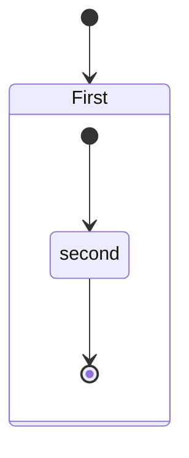

# Markdown PDF

<p>
  
</p>

この VS Code 拡張機能は Markdown ファイルを pdf、html、png、jpeg ファイルに変換します。

## 目次
<!-- TOC depthFrom:2 depthTo:2 updateOnSave:false -->

- [What's New](#whats-new)
- [仕様変更](#仕様変更)
- [機能](#機能)
- [Chromium](#chromium)
- [使い方](#使い方)
- [拡張機能 設定](#拡張機能-設定)
- [オプション](#オプション)
- [FAQ](#faq)
- [既知の問題](#既知の問題)
- [Change Log](#change-log)
- [License](#license)
- [Sponsor](#sponsor)
- [Special thanks](#special-thanks)

<!-- /TOC -->

<div class="page"/>

## What's New

バージョン 2 以降の主な新機能と改善点です。既存動作に影響する変更は [仕様変更](#仕様変更) を参照してください。

### 2.2.0

- エラー通知を改善し、対処ヒントと Show Details ボタンを追加（[詳細](#how-do-i-troubleshoot-a-failed-export)）
- 新しい Markdown PDF 出力チャネルへの詳細ログ出力を追加（[詳細](#how-do-i-troubleshoot-a-failed-export)）
- 不具合報告用の `Markdown PDF: Output Diagnostics` コマンドを追加（[詳細](#how-do-i-troubleshoot-a-failed-export)）

### 2.1.0

- `` ```plantuml `` フェンスドコードブロック記法のサポートを追加（[詳細](#plantuml)）
- KaTeX による数式描画のサポートを追加（[詳細](#math)）
- Chrome Stable 最新版の自動ダウンロードに対応（[詳細](#markdown-pdfchromiumautodownload)）

## 仕様変更

バージョン 2 以降で既存動作に影響する変更です。詳細は [FAQ](#faq) セクションを参照してください。

### 2.2.0

- `markdown-pdf.sanitize` が `"gfm"`（既定）または `"gfm-allow-style"` の場合、ブロックレベルの `<style>` / `<script>` / `<iframe>` 要素はエスケープして可視テキストとして残す代わりに、中身ごと除去されるようになりました。エクスポート時に除去が発生した場合は通知で報告されます。
    - 詳細: [Raw HTML がエスケープ／除去されるのはなぜ？](#why-is-my-raw-html-being-escaped-or-removed)

### 2.1.0

- セキュリティ強化: XSS のリスクに対応するため（[#411](https://github.com/yzane/vscode-markdown-pdf/issues/411)）、Markdown 内の Raw HTML が既定で [GFM Disallowed Raw HTML 拡張](https://github.github.com/gfm/#disallowed-raw-html-extension-) に準拠してサニタイズされるようになりました。`<script>` / `<iframe>` / `<style>` 等のタグおよび `on*` / `javascript:` 属性が Markdown 本文から除去されます。挙動は新しい [markdown-pdf.sanitize](#markdown-pdfsanitize) 設定で制御できます。
    - 詳細: [Why is my raw HTML being escaped or removed?](#why-is-my-raw-html-being-escaped-or-removed)

### 2.0.0

- 見出し ID の生成が GitHub 互換の VS Code slug 生成に変わりました。既存ドキュメント内の内部アンカーが変わる可能性があります。
    - 詳細: [Why did my heading anchors change?](#why-did-my-heading-anchors-change)
- highlight.js がバージョン 9 から 11 にアップグレードされました。一部のハイライトスタイル名が変更または削除されています。
    - 詳細: [Why did my syntax highlight style stop working?](#why-did-my-syntax-highlight-style-stop-working)
- フロントマターの解析がより厳格になりました。従来受け入れられていた一部の形式が拒否される場合があります。
    - 詳細: [Why is my front matter no longer parsed?](#why-is-my-front-matter-no-longer-parsed)
- Chromium はインストール済みの Chrome/Edge を優先して解決され、見つからなければ初回使用時に自動ダウンロードされます。
    - 詳細: [How is the Chromium browser selected?](#how-is-the-chromium-browser-selected) / [Where is Chromium downloaded?](#where-is-chromium-downloaded)

## 機能

Markdown PDF は、Markdown を PDF / HTML / PNG / JPEG に変換する際、標準の Markdown レンダラーに以下の機能を追加します。

### List

| カテゴリ | 機能 | 説明 | 記法例 |
|---|---|---|---|
| [Basic syntax extensions](#basic-syntax-extensions) | [Syntax highlighting](https://highlightjs.org/demo) | highlight.js によるコードブロックのハイライト | ` ```js ` |
| | [Emoji](https://www.webfx.com/tools/emoji-cheat-sheet/) | 絵文字ショートコード | `:smile:` |
| | [Checkbox](#checkbox) | GitHub 形式のタスクリスト | `- [ ]` / `- [x]` |
| | [Heading IDs](#heading-ids) | GitHub 互換の見出しアンカー | `# Heading` → `#heading` |
| [Content composition](#content-composition) | [Container](#container) | 注記ブロック | `::: warning` |
| | [Include](#include) | Markdown フラグメントの埋め込み | `:[label](path.md)` |
| [Diagrams & math](#diagrams--math) | [PlantUML](#plantuml) | コードブロックから UML 図を生成 | `@startuml` … `@enduml` |
| | [Mermaid](#mermaid) | フェンスドコードブロックから図を生成 | ` ```mermaid ` |
| | [Math](#math) | KaTeX による LaTeX 数式 | `$E = mc^2$` |

### Basic syntax extensions

#### Checkbox

`- [ ]` / `- [x]` のタスクリスト項目を、GitHub と同様に無効化済みのチェックボックスとしてレンダリングします。エクスポート後の出力でステータスを視認できるようにしたい進捗表やチェックリストに有用です。

Markdown
```
- [ ] Task A
- [x] Task B
```

Preview


#### Heading IDs

見出しには GitHub 互換のアンカー ID が自動的に付与されるため、`[Section](#section)` のような内部リンクが GitHub と同じ挙動になります。ASCII の見出しは小文字化され空白はハイフンに、非 ASCII の見出しは元の文字がそのまま使われます。

| 見出し | 生成される ID |
|---|---|
| `# My Heading` | `#my-heading` |
| `# API Reference` | `#api-reference` |
| `# 日本語見出し` | `#日本語見出し` |

See also: FAQ の [見出しのアンカーが変わったのはなぜ？](#why-did-my-heading-anchors-change)

### Content composition

#### Container

[markdown-it-container](https://github.com/markdown-it/markdown-it-container) による注記風ブロック。`:::` の後ろに書いた識別子がブロックの CSS クラスになるため、[markdown-pdf.styles](#markdown-pdfstyles) と組み合わせて警告・ヒント・補足などのスタイルを与えられます。

Markdown
```
::: warning
**Warning:** here be dragons
:::
```

スタイルシート（例: `markdown-pdf.css`）
```css
.warning {
  border-left: 4px solid #f0ad4e;
  background: #fff8e1;
  padding: 12px 16px;
  margin: 8px 0;
}
```

設定
```json
"markdown-pdf.styles": ["markdown-pdf.css"]
```

Preview


See also: [markdown-pdf.styles](#markdown-pdfstyles)

#### Include

`:[alternate-text](relative-path-to-file.md)` で別の Markdown ファイルの内容をインラインで埋め込みます。参照先のフラグメントを読み込めない場合（ファイルが存在しない、権限エラーなど）は、Include 記述位置にエラーを表示したうえで残りのドキュメントのエクスポートは継続されます。

以下のディレクトリ構成（`README.md` がエクスポート対象のドキュメント）を例にします:

```
├── [plugins]
│  └── README.md
├── CHANGELOG.md
└── README.md
```

Markdown
```
README Content

:[Plugins](./plugins/README.md)

:[Changelog](CHANGELOG.md)
```

Preview
```
Content of README.md

Content of plugins/README.md

Content of CHANGELOG.md
```

See also: [markdown-pdf.markdown-it-include.enable](#markdown-pdfmarkdown-it-includeenable)

### Diagrams & math

#### PlantUML

[markdown-it-plantuml](https://github.com/gmunguia/markdown-it-plantuml) を使って [PlantUML](https://plantuml.com/) で UML 図をレンダリングします。2 つの等価な記法をサポートし、いずれも同じ `` タグを生成し、[markdown-pdf.plantumlServer](#markdown-pdfplantumlserver) 設定を共有します。

##### Fenced code block

```` ```plantuml ```` のフェンスドコードブロック記法です。これは PlantUML のエコシステムで一般的なフェンス記法（例: PlantUML 連携が有効なとき [GitLab はこの記法をネイティブにレンダリング](https://docs.gitlab.com/administration/integration/plantuml/) します）。

Markdown

````
```plantuml
Bob -[#red]> Alice : hello
Alice -[#0000FF]->Bob : ok
```
````

##### Block markers

`@startuml` / `@enduml` ブロックマーカーです。マーカーは [markdown-pdf.plantumlOpenMarker](#markdown-pdfplantumlopenmarker) / [markdown-pdf.plantumlCloseMarker](#markdown-pdfplantumlclosemarker) でカスタマイズ可能です。

Markdown

```
@startuml
Bob -[#red]> Alice : hello
Alice -[#0000FF]->Bob : ok
@enduml
```

Preview (either form produces the same image)


See also: [markdown-pdf.plantumlServer](#markdown-pdfplantumlserver)

#### Mermaid

[Mermaid](https://mermaid-js.github.io/mermaid/) によってフェンスドコードブロックから図をレンダリングします。Mermaid のライブラリは [markdown-pdf.mermaidServer](#markdown-pdfmermaidserver) で指定された URL から読み込まれます（既定値は CDN）。

Markdown

<pre>

```mermaid
stateDiagram
    [*] --> First
    state First {
        [*] --> second
        second --> [*]
    }
```
</pre>

Preview


#### Math

[KaTeX](https://katex.org/) による LaTeX 数式レンダリング。`$…$` / `$$…$$` / `\begin{env}…\end{env}` は [@vscode/markdown-it-katex](https://github.com/microsoft/vscode-markdown-it-katex)（VS Code 標準の Markdown プレビューと同じプラグイン）で、`\(…\)` / `\[…\]` のブラケット区切りは自前の小さなプラグインで処理します。レンダリングは Node 上で実行され、ネットワーク接続は不要です。

対応記法:

- インライン: `$E = mc^2$`, `\(E = mc^2\)`
- ディスプレイ: `$$\int_0^\infty f(x)\,dx$$`, `\[\alpha\]`
- LaTeX 環境: `\begin{aligned}a &= b\\c &= d\end{aligned}`
- フェンスドコードブロック:

    ````
    ```math
    \sum_{i=1}^{n} i = \frac{n(n+1)}{2}
    ```
    ````

Markdown

<pre>
Inline: $E = mc^2$

Display:

$$\int_0^\infty e^{-x^2}\,dx = \frac{\sqrt{\pi}}{2}$$

LaTeX environment:

\begin{aligned}
x + y &= 10 \\
x - y &= 4
\end{aligned}
</pre>

Preview


See also:

- [markdown-pdf.math.enabled](#markdown-pdfmathenabled) — 数式レンダリングの無効化
- [markdown-pdf.math.katex.macros](#markdown-pdfmathkatexmacros) — KaTeX のユーザー定義マクロ

### Sample files

この README を各形式に変換したサンプル:

- [pdf](sample/README.pdf)
- [html](sample/README.html)
- [png](sample/README.png)
- [jpeg](sample/README.jpeg)

## Chromium

Markdown PDF は PDF/PNG/JPEG エクスポートに Chromium ベースのブラウザを使用します。以下の順番で解決を試みます:

1. [markdown-pdf.executablePath](#markdown-pdfexecutablepath) で指定されたパス
2. システムにインストール済みの Google Chrome / Microsoft Edge / Chromium
3. 初回使用時に自動ダウンロードされ、以降は VS Code 起動ごとに最新の Chrome Stable に追従して更新される管理済み Chromium（[markdown-pdf.chromium.autoDownload](#markdown-pdfchromiumautodownload) で無効化可能）

詳細は FAQ の [How is the Chromium browser selected?](#how-is-the-chromium-browser-selected) および [Where is Chromium downloaded?](#where-is-chromium-downloaded) を参照してください。

プロキシ経由で接続している場合は、settings.json に `http.proxy` オプションを設定し、Visual Studio Code を再起動してください。

<div class="page"/>

## 使い方

### コマンド パレット

1. Markdown ファイルを開きます
1. `F1` キーを押すか、`Ctrl+Shift+P` キーを入力します
1. `export` と入力し以下を選択します
   * `markdown-pdf: Export (settings.json)`
   * `markdown-pdf: Export (pdf)`
   * `markdown-pdf: Export (html)`
   * `markdown-pdf: Export (png)`
   * `markdown-pdf: Export (jpeg)`
   * `markdown-pdf: Export (all: pdf, html, png, jpeg)`

不具合報告用の環境情報を収集するには `Markdown PDF: Output Diagnostics` を実行します。FAQ の [エクスポート失敗時のトラブルシューティング方法は？](#how-do-i-troubleshoot-a-failed-export) を参照してください。


### メニュー

1. Markdown ファイルを開きます
1. 右クリックして以下を選択します
   * `markdown-pdf: Export (settings.json)`
   * `markdown-pdf: Export (pdf)`
   * `markdown-pdf: Export (html)`
   * `markdown-pdf: Export (png)`
   * `markdown-pdf: Export (jpeg)`
   * `markdown-pdf: Export (all: pdf, html, png, jpeg)`


### 自動変換

1. **settings.json** に `"markdown-pdf.convertOnSave": true` オプションを追加します
1. Visual Studio Code を再起動します
1. Markdown ファイルを開きます
1. 保存すると自動で変換されます

## 拡張機能 設定

[Visual Studio Code User and Workspace Settings](https://code.visualstudio.com/docs/customization/userandworkspace)

1. メニューから **ファイル > 基本設定 > ユーザー設定 か ワークスペース設定** を選択します
1. **既定の設定** から markdown-pdf の設定を探します
1. `markdown-pdf.*` の設定をコピーします
1. **settings.json** に貼り付け、値を変更します


## オプション

### List

|Category|Option name|[Configuration scope](https://code.visualstudio.com/api/references/contribution-points#Configuration-property-schema)|
|:---|:---|:---|
|[Save options](#save-options)|[markdown-pdf.type](#markdown-pdftype)| |
||[markdown-pdf.convertOnSave](#markdown-pdfconvertonsave)| |
||[markdown-pdf.convertOnSaveExclude](#markdown-pdfconvertonsaveexclude)| |
||[markdown-pdf.outputDirectory](#markdown-pdfoutputdirectory)| |
||[markdown-pdf.outputDirectoryRelativePathFile](#markdown-pdfoutputdirectoryrelativepathfile)| |
|[Styles options](#styles-options)|[markdown-pdf.styles](#markdown-pdfstyles)| |
||[markdown-pdf.stylesRelativePathFile](#markdown-pdfstylesrelativepathfile)| |
||[markdown-pdf.includeDefaultStyles](#markdown-pdfincludedefaultstyles)| |
|[Syntax highlight options](#syntax-highlight-options)|[markdown-pdf.highlight](#markdown-pdfhighlight)| |
||[markdown-pdf.highlightStyle](#markdown-pdfhighlightstyle)| |
|[Markdown options](#markdown-options)|[markdown-pdf.breaks](#markdown-pdfbreaks)| |
|[Emoji options](#emoji-options)|[markdown-pdf.emoji](#markdown-pdfemoji)| |
|[Configuration options](#configuration-options)|[markdown-pdf.executablePath](#markdown-pdfexecutablepath)| |
||[markdown-pdf.chromium.autoDownload](#markdown-pdfchromiumautodownload)| |
|[Common Options](#common-options)|[markdown-pdf.scale](#markdown-pdfscale)| |
|[PDF options](#pdf-options)|[markdown-pdf.displayHeaderFooter](#markdown-pdfdisplayheaderfooter)|resource|
||[markdown-pdf.headerTemplate](#markdown-pdfheadertemplate)|resource|
||[markdown-pdf.footerTemplate](#markdown-pdffootertemplate)|resource|
||[markdown-pdf.printBackground](#markdown-pdfprintbackground)|resource|
||[markdown-pdf.orientation](#markdown-pdforientation)|resource|
||[markdown-pdf.pageRanges](#markdown-pdfpageranges)|resource|
||[markdown-pdf.format](#markdown-pdfformat)|resource|
||[markdown-pdf.width](#markdown-pdfwidth)|resource|
||[markdown-pdf.height](#markdown-pdfheight)|resource|
||[markdown-pdf.margin.top](#markdown-pdfmargintop)|resource|
||[markdown-pdf.margin.bottom](#markdown-pdfmarginbottom)|resource|
||[markdown-pdf.margin.right](#markdown-pdfmarginright)|resource|
||[markdown-pdf.margin.left](#markdown-pdfmarginleft)|resource|
|[PNG JPEG options](#png-jpeg-options)|[markdown-pdf.quality](#markdown-pdfquality)| |
||[markdown-pdf.clip.x](#markdown-pdfclipx)| |
||[markdown-pdf.clip.y](#markdown-pdfclipy)| |
||[markdown-pdf.clip.width](#markdown-pdfclipwidth)| |
||[markdown-pdf.clip.height](#markdown-pdfclipheight)| |
||[markdown-pdf.omitBackground](#markdown-pdfomitbackground)| |
|[PlantUML options](#plantuml-options)|[markdown-pdf.plantumlOpenMarker](#markdown-pdfplantumlopenmarker)| |
||[markdown-pdf.plantumlCloseMarker](#markdown-pdfplantumlclosemarker)| |
||[markdown-pdf.plantumlServer](#markdown-pdfplantumlserver)| |
|[markdown-it-include options](#markdown-it-include-options)|[markdown-pdf.markdown-it-include.enable](#markdown-pdfmarkdown-it-includeenable)| |
|[mermaid options](#mermaid-options)|[markdown-pdf.mermaidServer](#markdown-pdfmermaidserver)| |
|[math options](#math-options)|[markdown-pdf.math.enabled](#markdown-pdfmathenabled)| |
||[markdown-pdf.math.katex.macros](#markdown-pdfmathkatexmacros)| |
|[Sanitize options](#sanitize-options)|[markdown-pdf.sanitize](#markdown-pdfsanitize)| |

### Save options

#### `markdown-pdf.type`
  - 出力フォーマット: pdf, html, png, jpeg
  - 複数の出力フォーマットをサポート
  - Default: pdf

```javascript
"markdown-pdf.type": [
  "pdf",
  "html",
  "png",
  "jpeg"
],
```

#### `markdown-pdf.convertOnSave`
  - 保存時の自動変換を有効にします
  - boolean. Default: false
  - 設定の反映には、Visual Studio Code の再起動が必要です

#### `markdown-pdf.convertOnSaveExclude`
  - convertOnSave オプションの除外ファイル名を指定します

```javascript
"markdown-pdf.convertOnSaveExclude": [
  "^work",
  "work.md$",
  "work|test",
  "[0-9][0-9][0-9][0-9]-work",
  "work\\test"  // 全ての \ は \\ と記述する必要があります。(Windows)
],
```

#### `markdown-pdf.outputDirectory`
  - 出力ディレクトリを指定します
  - 全ての `\` は `\\` と記述する必要があります (Windows)

```javascript
"markdown-pdf.outputDirectory": "C:\\work\\output",
```

  - 相対パス
    - `Markdownファイル` を開いた場合、ファイルからの相対パスとして解釈されます
    - `フォルダ` を開いた場合、ルートフォルダからの相対パスとして解釈されます
    - `ワークスペース` を開いた場合、それぞれのルートフォルダからの相対パスとして解釈されます
      - [マルチルート ワークスペース](https://code.visualstudio.com/docs/editor/multi-root-workspaces) を参照してください

```javascript
"markdown-pdf.outputDirectory": "output",
```

  - 相対パス (ホームディレクトリ)
    - パスが `~` で始まっている場合、ホームディレクトリからの相対パスとして解釈されます

```javascript
"markdown-pdf.outputDirectory": "~/output",
```

  - `相対パス`でディレクトリを設定した場合、ディレクトリが存在しなければ作成されます
  - `絶対パス`でディレクトリを設定した場合、ディレクトリが存在しなければエラーになります

#### `markdown-pdf.outputDirectoryRelativePathFile`
  - `markdown-pdf.outputDirectoryRelativePathFile` オプションが `true` に設定されている場合、[markdown-pdf.outputDirectory](#markdown-pdfoutputDirectory) で設定した相対パスは、ファイルからの相対パスとして解釈されます
  - フォルダやワークスペースからの相対パスを避けたい場合に使うことが出来ます
  - boolean. Default: false

### Styles options

#### `markdown-pdf.styles`
  - markdown-pdf で使用するスタイルシートのパスを指定します
  - ファイルが存在しない場合、スキップされます
  - 全ての `\` は `\\` と記述する必要があります (Windows)

```javascript
"markdown-pdf.styles": [
  "C:\\Users\\<USERNAME>\\Documents\\markdown-pdf.css",
  "/home/<USERNAME>/settings/markdown-pdf.css",
],
```

  - 相対パス
    - `Markdownファイル` を開いた場合、ファイルからの相対パスとして解釈されます
    - `フォルダ` を開いた場合、ルートフォルダからの相対パスとして解釈されます
    - `ワークスペース` を開いた場合、それぞれのルートフォルダからの相対パスとして解釈されます
      - [マルチルート ワークスペース](https://code.visualstudio.com/docs/editor/multi-root-workspaces) を参照してください

```javascript
"markdown-pdf.styles": [
  "markdown-pdf.css",
],
```

  - 相対パス (ホームディレクトリ)
    - パスが `~` で始まっている場合、ホームディレクトリからの相対パスとして解釈されます

```javascript
"markdown-pdf.styles": [
  "~/.config/Code/User/markdown-pdf.css"
],
```

  - オンラインCSS (https://xxx/xxx.css) は JPG と PNG では正しく適用されますが、PDF では問題が発生します [#67](https://github.com/yzane/vscode-markdown-pdf/issues/67)

```javascript
"markdown-pdf.styles": [
  "https://xxx/markdown-pdf.css"
],
```

#### `markdown-pdf.stylesRelativePathFile`
  - `markdown-pdf.stylesRelativePathFile` オプションが `true` に設定されている場合、[markdown-pdf.styles](#markdown-pdfstyles) で設定した相対パスは、ファイルからの相対パスとして解釈されます
  - フォルダやワークスペースからの相対パスを避けたい場合に使うことが出来ます
  - boolean. Default: false

#### `markdown-pdf.includeDefaultStyles`
  - デフォルトのスタイルシート(VSCode, markdown-pdf)を有効にします
  - boolean. Default: true

### Syntax highlight options

#### `markdown-pdf.highlight`
  - Syntax highlighting を有効にします
  - boolean. Default: true

#### `markdown-pdf.highlightStyle`
  - 現在の `highlight.js` のスタイルファイル名を指定します。例: `github.css`, `monokai.css`, `base16/solarized-dark.css`
  - [ファイル名のリスト](https://github.com/highlightjs/highlight.js/tree/main/src/styles)
  - [highlight.js demo](https://highlightjs.org/demo)

```javascript
"markdown-pdf.highlightStyle": "github.css",
```

### Markdown options

#### `markdown-pdf.breaks`
  - 改行を有効にします
  - boolean. Default: false

### Emoji options

#### `markdown-pdf.emoji`
  - 絵文字を有効にします [EMOJI CHEAT SHEET](https://www.webfx.com/tools/emoji-cheat-sheet/)
  - boolean. Default: true

### Configuration options

#### `markdown-pdf.executablePath`
  - バンドルされた Chromium の代わりに実行する Google Chrome / Microsoft Edge / Chromium のパスを指定します
  - この設定がインストール済みブラウザの検出や管理済み Chromium のダウンロードとどう連携するかは、FAQ の [How is the Chromium browser selected?](#how-is-the-chromium-browser-selected) を参照してください
  - 全ての `\` は `\\` と記述する必要があります (Windows)
  - 設定の反映には、Visual Studio Code の再起動が必要です

```javascript
"markdown-pdf.executablePath": "C:\\Program Files (x86)\\Google\\Chrome\\Application\\chrome.exe"
```

#### `markdown-pdf.chromium.autoDownload`
  - インストール済みブラウザが見つからないとき、管理済み Chromium を自動ダウンロードするかを指定します
  - boolean. Default: true
  - `false` の場合、Markdown PDF は Chromium を自動ダウンロードせず、[markdown-pdf.executablePath](#markdown-pdfexecutablepath) または インストール済みの Google Chrome / Microsoft Edge / Chromium のみを使用します。どれも見つからない場合、エクスポートはエラーになります。
  - 完全な解決順序は FAQ の [How is the Chromium browser selected?](#how-is-the-chromium-browser-selected) を参照してください

```javascript
"markdown-pdf.chromium.autoDownload": true
```

### Common Options

#### `markdown-pdf.scale`
  - ページレンダリングのスケール
  - number. Default: 1

```javascript
"markdown-pdf.scale": 1
```

### PDF options

  - pdf only. [puppeteer page.pdf options](https://github.com/puppeteer/puppeteer/blob/main/docs/api/puppeteer.pdfoptions.md)

#### `markdown-pdf.displayHeaderFooter`
  - ヘッダーとフッター表示を有効にします
  - boolean. Default: true
  - このオプションを有効にすると、ヘッダーとフッターが両方表示されます
  - 片方を表示したくない場合は、もう片方の値を削除します
  - ヘッダー非表示
    ```javascript
    "markdown-pdf.headerTemplate": "",
    ```
  - フッター非表示
    ```javascript
    "markdown-pdf.footerTemplate": "",
    ```

#### `markdown-pdf.headerTemplate`
  - ヘッダーを出力する為のHTMLテンプレートを指定します
  - このオプションを使用するには、`markdown-pdf.displayHeaderFooter` を `true` に設定する必要があります。
  - `<span class='date'></span>` : 日付。フォーマットは環境に依存します
  - `<span class='title'></span>` : Markdown ファイル名
  - `<span class='url'></span>` : Markdown フルパスファイル名
  - `<span class='pageNumber'></span>` : 現在のページ番号
  - `<span class='totalPages'></span>` : ドキュメントの総ページ数
  - `%%ISO-DATETIME%%` : 現在の日付と時刻。ISOベース フォーマット (`YYYY-MM-DD hh:mm:ss`)
  - `%%ISO-DATE%%` : 現在の日付。ISOベース フォーマット (`YYYY-MM-DD`)
  - `%%ISO-TIME%%` : 現在の時刻。ISOベース フォーマット (`hh:mm:ss`)
  - Default (version1.5.0以降): Markdown ファイル名 と 日付を `%%ISO-DATE%%` で表示します
    ```javascript
    "markdown-pdf.headerTemplate": "<div style=\"font-size: 9px; margin-left: 1cm;\"> <span class='title'></span></div> <div style=\"font-size: 9px; margin-left: auto; margin-right: 1cm; \">%%ISO-DATE%%</div>",
    ```
  - Default (version1.4.4以前): Markdown ファイル名 と 日付を `<span class='date'></span>` で表示します
    ```javascript
    "markdown-pdf.headerTemplate": "<div style=\"font-size: 9px; margin-left: 1cm;\"> <span class='title'></span></div> <div style=\"font-size: 9px; margin-left: auto; margin-right: 1cm; \"> <span class='date'></span></div>",
    ```

#### `markdown-pdf.footerTemplate`
  - フッターを出力する為のHTMLテンプレートを指定します
  - 詳細は、[markdown-pdf.headerTemplate](#markdown-pdfheadertemplate) を参照してください
  - Default: {現在のページ番号} / {ドキュメントの総ページ数} を表示します
    ```javascript
    "markdown-pdf.footerTemplate": "<div style=\"font-size: 9px; margin: 0 auto;\"> <span class='pageNumber'></span> / <span class='totalPages'></span></div>",
    ```

#### `markdown-pdf.printBackground`
  - 背景のグラフィックを出力
  - boolean. Default: true

#### `markdown-pdf.orientation`
  - ページの向き
  - portrait(縦向き) or landscape(横向き)
  - Default: portrait

#### `markdown-pdf.pageRanges`
  - 出力するページ範囲 例) '1-5, 8, 11-13'
  - Default: 全ページ

```javascript
"markdown-pdf.pageRanges": "1,4-",
```

#### `markdown-pdf.format`
  - 用紙のフォーマット
  - Letter, Legal, Tabloid, Ledger, A0, A1, A2, A3, A4, A5, A6
  - Default: A4

```javascript
"markdown-pdf.format": "A4",
```

#### `markdown-pdf.width`
#### `markdown-pdf.height`
  - 用紙の幅/高さ、 単位(mm, cm, in, px)
  - このオプションが指定されている場合、markdown-pdf.format オプションより優先されます

```javascript
"markdown-pdf.width": "10cm",
"markdown-pdf.height": "20cm",
```

#### `markdown-pdf.margin.top`
#### `markdown-pdf.margin.bottom`
#### `markdown-pdf.margin.right`
#### `markdown-pdf.margin.left`
  - 用紙の余白、単位(mm, cm, in, px)

```javascript
"markdown-pdf.margin.top": "1.5cm",
"markdown-pdf.margin.bottom": "1cm",
"markdown-pdf.margin.right": "1cm",
"markdown-pdf.margin.left": "1cm",
```

### PNG, JPEG options

  - png and jpeg only. [puppeteer page.screenshot options](https://github.com/puppeteer/puppeteer/blob/main/docs/api/puppeteer.screenshotoptions.md)

#### `markdown-pdf.quality`
  - jpeg only. イメージの品質を 0-100 の範囲で指定します。 png では無効です。

```javascript
"markdown-pdf.quality": 100,
```

#### `markdown-pdf.clip.x`
#### `markdown-pdf.clip.y`
#### `markdown-pdf.clip.width`
#### `markdown-pdf.clip.height`
  - ページの切り抜き領域を指定します
  - number

```javascript
// 切り抜き領域のX軸の基点を指定します。ページの左上が原点です。
"markdown-pdf.clip.x": 0,

// 切り抜き領域のY軸の基点を指定します。ページの左上が原点です。
"markdown-pdf.clip.y": 0,

// 切り抜き領域の幅を指定します
"markdown-pdf.clip.width": 1000,

// 切り抜き領域の高さを指定します
"markdown-pdf.clip.height": 1000,
```

#### `markdown-pdf.omitBackground`
  - デフォルトの白い背景ではなく、透過によるスクリーンショットのキャプチャーを有効にします
  - boolean. Default: false

### PlantUML options

#### `markdown-pdf.plantumlOpenMarker`
  - `@startuml` / `@enduml` ブロックマーカー記法で使用する開始区切り文字です。別の開始マーカーを使いたい場合に変更します。
  - Default: @startuml

#### `markdown-pdf.plantumlCloseMarker`
  - `@startuml` / `@enduml` ブロックマーカー記法で使用する終了区切り文字です。別の終了マーカーを使いたい場合に変更します。
  - Default: @enduml

#### `markdown-pdf.plantumlServer`
  - Plantuml server. e.g. http://localhost:8080
  - Default: http://www.plantuml.com/plantuml
  - 例えば、PlantUMLサーバをローカルで実行するには次のようにします [#139](https://github.com/yzane/vscode-markdown-pdf/issues/139) :
    ```
    docker run -d -p 8080:8080 plantuml/plantuml-server:jetty
    ```
    [plantuml/plantuml-server - Docker Hub](https://hub.docker.com/r/plantuml/plantuml-server/)

### markdown-it-include options

#### `markdown-pdf.markdown-it-include.enable`
  - markdown-it-include を有効にします
  - boolean. Default: true

### mermaid options

#### `markdown-pdf.mermaidServer`
  - mermaid server
  - Default: https://unpkg.com/mermaid/dist/mermaid.min.js

### math options

#### `markdown-pdf.math.enabled`
  - `$…$`, `$$…$$`, `\(…\)`, `\[…\]`, ` ```math ` フェンスドコードブロックを KaTeX で数式としてレンダリングするかを切り替えます。
  - VS Code 標準の Markdown プレビューの挙動と一致します。
  - `false` に設定すると `$` / `\(` / `\[` / ` ```math ` をそのままのテキストとして保持します（`$X$` のようなプレースホルダが文書内にあり、数式として解釈されてほしくない場合に使用）。
  - 単一ドキュメントだけ数式を無効化したい場合は、該当箇所の `$` を `\$` にエスケープするか、YAML フロントマターで設定を上書きします:

    ```yaml
    ---
    math:
      enabled: false
    ---
    ```
  - boolean. Default: true

#### `markdown-pdf.math.katex.macros`
  - KaTeX レンダラーに渡す、ユーザー定義の [KaTeX マクロ](https://katex.org/docs/options.html)。
  - 例: `{ "\\RR": "\\mathbb{R}" }`
  - ドキュメントごとのマクロは YAML フロントマターで指定でき、この設定より優先されます:

    ```yaml
    ---
    math:
      katex:
        macros:
          "\\RR": "\\mathbb{R}"
    ---
    ```
  - Default: {}

### Sanitize options

#### `markdown-pdf.sanitize`
  - Markdown 内の Raw HTML のサニタイズモード
  - `"gfm"`: GFM の禁止タグおよび危険な属性を除去（既定）
  - `"gfm-allow-style"`: `"gfm"` と同様、ただし `<style>` 要素は残す
  - `"none"`: サニタイズ無効（従来の動作、非推奨）
  - Default: `"gfm"`

```javascript
"markdown-pdf.sanitize": "gfm",
```

## FAQ

### 絵文字 サイズの変更方法は？

1. 以下の設定を markdown-pdf.styles で指定したスタイルシートに追加します。

```css
.emoji {
  height: 2em;
}
```

### 文字コードの自動判定

Visual Studio Code の `files.autoGuessEncoding` オプションを使うと、文字コードが自動判定されるので便利です。

```javascript
"files.autoGuessEncoding": true,
```

### 出力ディレクトリ

常に Markdown ファイルからの相対パスのディレクトリに出力したい場合。

例えば、Markdown ファイルと同じディレクトリの "output"ディレクトリに出力する場合、次のように設定してください。

```javascript
"markdown-pdf.outputDirectory" : "output",
"markdown-pdf.outputDirectoryRelativePathFile": true,
```

### 改ページ

改ページを挿入するには、以下のいずれかを使用してください。

``` html
<div class="page"/>
```

``` html
<div class="page"></div>
```

<a id="why-did-my-heading-anchors-change"></a>

### 見出しのアンカーが変わったのはなぜ？

バージョン 2.0.0 から、Markdown PDF は GitHub 互換の VS Code slug 生成に準拠したカスタム実装の `markdown-it-named-headers` で見出し ID を生成します。従来の実装と比較して、新しい slug ジェネレータは CJK 文字とアンダースコアを保持する一方でサポートされない記号を除去するため、既存の内部アンカー (例: `#some-heading`) の解決結果が変わる可能性があります。

目次や相互参照など特定のアンカー文字列に依存している Markdown を使っている場合は、エクスポート後にアンカーを確認し、リンクを必要に応じて更新してください。

<a id="why-did-my-syntax-highlight-style-stop-working"></a>

### シンタックスハイライトのスタイルが効かなくなったのはなぜ？

バージョン 2.0.0 から、Markdown PDF は `highlight.js` v11 を使用するようになりました (以前は v9)。v9 のスタイル名の一部は名称変更または削除されています。Markdown PDF は古いスタイル名を可能な範囲で現在の名前にマッピングし、見つからないときは警告メッセージを表示します。マッピング不能な場合は `tomorrow.css` にフォールバックします。

[利用可能なスタイル](https://github.com/highlightjs/highlight.js/tree/main/src/styles)を確認し、[markdown-pdf.highlightStyle](#markdown-pdfhighlightstyle) の設定を現行のスタイル名に更新してください。

<a id="why-is-my-front-matter-no-longer-parsed"></a>

### フロントマターが解析されなくなったのはなぜ？

バージョン 2.0.0 から、Markdown PDF は `gray-matter` ではなくカスタム実装で YAML フロントマターを解析します。新しいパーサーはより厳格で、以前のパーサーが受け入れていた以下のケースを拒否します:

- トップレベルが YAML シーケンス (配列) のフロントマター
- プレーンオブジェクトに解析されないフロントマター
- 不正な YAML 構造

有効なフロントマターはトップレベルが YAML マッピング (オブジェクト) である必要があります。例:

``` yaml
---
title: My Document
"markdown-pdf":
  displayHeaderFooter: true
---
```

BOM 付きファイルは引き続きサポートされます。

<a id="why-is-my-raw-html-being-escaped-or-removed"></a>

### Raw HTML がエスケープ／除去されるのはなぜ？

以前のバージョンでは Markdown 内の Raw HTML を検証せずにそのままレンダラに渡していたため、`<script>` や `<iframe>` 等がプレビュー／PDF 生成時に実行される可能性があり、信頼できない Markdown を開いたときに XSS のリスクがありました（[#411](https://github.com/yzane/vscode-markdown-pdf/issues/411)）。

バージョン 2.1.0 から、Markdown 本文内の Raw HTML は既定で [GFM Disallowed Raw HTML 拡張](https://github.github.com/gfm/#disallowed-raw-html-extension-) に準拠したサニタイズが適用されます。挙動は `markdown-pdf.sanitize` で制御します:

| モード | 挙動 |
| --- | --- |
| `"gfm"` (既定) | GFM の禁止タグおよび危険な属性を除去。他者が作成した Markdown を開く可能性がある通常利用に推奨。 |
| `"gfm-allow-style"` | `"gfm"` と同様、ただし `<style>` は残す。自身で書いた Markdown に CSS を同梱して 1 ファイル完結の PDF を作成したい場合向け。**信頼できるコンテンツに限って使用してください** — `<script>` を許可しなくても、CSS の `url(...)` / `@import` / `@font-face` 経由で攻撃者が指定する URL にリクエストを発生させて情報を漏えいさせる手口 (CSS exfiltration) が知られています。 |
| `"none"` | サニタイズ無効。従来互換。基本的に非推奨。 |

**`"gfm"` で除去される対象**

禁止タグ:
`<title>`, `<textarea>`, `<style>`, `<xmp>`, `<iframe>`, `<noembed>`, `<noframes>`, `<script>`, `<plaintext>`

バージョン 2.2.0 から、ブロックレベルの `<style>` / `<script>` / `<iframe>` 要素は中身ごと除去されるため、CSS や JavaScript のソースコードが可視テキストとして出力に残ることはなくなりました。それ以外のケース — 上記のその他の禁止タグ、および任意の禁止タグのインライン出現 — は開きの `<` が `&lt;` にエスケープされ、中身は可視テキストとして残ります。2.1.0 ではすべてがエスケープされていました。

属性:
- `on*` イベントハンドラ（`onclick`, `onload` 等）
- `href` / `src` の値が `javascript:` で始まるもの

**サニタイズ通知**

バージョン 2.2.0 から、エクスポート時に要素の除去や属性の除去が発生した場合、その内容が通知で報告されます: 手動エクスポート時は「Show Details」ボタン付きトースト、[自動変換](#自動変換)時は「Markdown PDF」出力チャネルへの記録となります。

**本文内 `<style>` からの移行**

PDF レイアウト調整のために Markdown 本文内で `<style>` を使っていた場合、CSS を別ファイルに移し `markdown-pdf.styles` で読み込むことで同等のカスタマイズが可能です。外部スタイルシートは VS Code 設定から読み込まれるため、本文の Raw HTML とは異なりサニタイズの影響を受けません。

外部 CSS の注意点:

- CSS は `@import url(...)`, `background: url(...)`, 属性セレクタ + `url(...)` 等によって外部送信が可能です。信頼できる CSS ファイルのみを指定してください。
- `markdown-pdf.stylesRelativePathFile: true` の場合、スタイルシートのパスは開いた Markdown ファイルからの相対として解決されます。信頼できない場所にある Markdown を開くと、隣接する悪意ある `.css` を読み込む可能性があります。

**サニタイズの適用範囲**

サニタイズ対象:
- Markdown 本文内に書かれた Raw HTML（markdown-it の `html_block` / `html_inline` として処理されるもの）
- Include 機能（`:[label](path.md)`）でインクルードされたファイルの内容（同じレンダラを通るため自動的に適用されます）

サニタイズ対象外:
- `markdown-pdf.styles` で指定された外部 CSS（意図的に対象外。ユーザー設定による明示指定が信頼境界）
- 拡張内蔵の CSS およびテンプレート HTML
- 拡張自身が生成する HTML（mermaid、highlight.js、emoji、PlantUML の出力）

<a id="how-do-i-troubleshoot-a-failed-export"></a>

### エクスポート失敗時のトラブルシューティング方法は？

バージョン 2.2.0 から、拡張は詳細ログを **Markdown PDF** 出力チャネルに記録します。**表示** > **出力** を開き、ドロップダウンから **Markdown PDF** を選択してください。

- エクスポートが失敗すると、エラートーストに何が失敗したかが表示され、よくある原因（Chromium の起動失敗、出力ファイルのロック、権限不足、ディスク容量不足、出力先ディレクトリの不正）には対処ヒントが 1 行添えられます。**Show Details** ボタンを押すと、コンテキスト・エラーメッセージ・スタックトレースを含むログが開きます。
- 各エクスポートの開始時に環境スナップショットと変換コンテキストがログに記録されるため、通常はログだけで状況を把握できます。
- コマンドパレットから `Markdown PDF: Output Diagnostics` を実行すると、環境・設定の診断情報（拡張のバージョン、VS Code / OS 情報、Chromium のパスと選択経緯、関連設定）が出力されます。ホームディレクトリのパスはマスクされます。

issue を発行する際は、`Markdown PDF: Output Diagnostics` の出力と **Show Details** で表示されるログを添付してください。

<a id="how-is-the-chromium-browser-selected"></a>

### Chromium ブラウザはどのように選択されますか？

Markdown PDF は以下の順番で Chromium ベースのブラウザを解決します:

1. [markdown-pdf.executablePath](#markdown-pdfexecutablepath) で指定されたパス (ファイルが存在する場合)
2. システムにインストール済みのブラウザ。Google Chrome (stable) は [@puppeteer/browsers](https://pptr.dev/browsers-api) 経由で OS 標準のインストール場所から検出されます。Microsoft Edge と Chromium は下記の固定パスを順にスキャンします。
3. Markdown PDF が初回使用時に自動ダウンロードする管理済み Chromium

最初にマッチしたものが使用されます。OS ごとの検出順序は以下のとおりです。

**Windows**

1. Google Chrome (stable インストール、`@puppeteer/browsers` で検出)
2. `%LOCALAPPDATA%\Microsoft\Edge\Application\msedge.exe`
3. `%LOCALAPPDATA%\Chromium\Application\chrome.exe`
4. `%PROGRAMFILES%\Microsoft\Edge\Application\msedge.exe`
5. `%PROGRAMFILES%\Chromium\Application\chrome.exe`
6. `%PROGRAMFILES(X86)%\Microsoft\Edge\Application\msedge.exe`
7. `%PROGRAMFILES(X86)%\Chromium\Application\chrome.exe`

**macOS**

1. Google Chrome (stable インストール、`@puppeteer/browsers` で検出)
2. `/Applications/Chromium.app/Contents/MacOS/Chromium`
3. `/Applications/Microsoft Edge.app/Contents/MacOS/Microsoft Edge`

**Linux**

1. Google Chrome (stable インストール、`@puppeteer/browsers` で検出)
2. `/usr/bin/chromium-browser`
3. `/usr/bin/chromium`
4. `/usr/bin/microsoft-edge`
5. `/usr/bin/microsoft-edge-stable`

<a id="where-is-chromium-downloaded"></a>

### Chromium はどこにダウンロードされますか？

インストール済みブラウザが見つからない場合、Markdown PDF は初回使用時に管理済み Chromium をダウンロードします。ダウンロード先は拡張機能の VS Code global storage ディレクトリです:

| OS | ダウンロードパス |
| --- | --- |
| Windows | `%APPDATA%\Code\User\globalStorage\yzane.markdown-pdf\` |
| macOS | `~/Library/Application Support/Code/User/globalStorage/yzane.markdown-pdf/` |
| Linux | `~/.config/Code/User/globalStorage/yzane.markdown-pdf/` |

VS Code Insiders や VSCodium を使用している場合は、ベースパスが `Code - Insiders` や `VSCodium` などに変わります。

ダウンロード中はステータスバーに `Installing Chromium` が表示されます。

**ダウンロードされる Chromium のビルド**

Markdown PDF はまず [Chrome for Testing API](https://googlechromelabs.github.io/chrome-for-testing/last-known-good-versions.json) から最新の Chrome Stable の build id を取得しようとします。最新 build id の確認は VS Code セッションごとに 1 回実行され、Chrome Stable の新版がリリースされていれば次回エクスポート時に新しいビルドをダウンロードし、以前のキャッシュ済みビルドは削除されます。同一セッション内では取得した build id がメモ化されるため、リリース直後の新版を取り込むには VS Code を再起動してください。

API に到達できない場合は、以下の順にフォールバックします:

1. 上表のグローバルストレージディレクトリに残る最新のキャッシュ済みビルド
2. バンドルされた `puppeteer-core` に固定された build id（最終フォールバック）

**自動ダウンロードの無効化**

[markdown-pdf.chromium.autoDownload](#markdown-pdfchromiumautodownload) を `false` に設定すると、自動ダウンロードを完全にスキップします。その場合、Markdown PDF は [markdown-pdf.executablePath](#markdown-pdfexecutablepath) または インストール済みの Google Chrome / Microsoft Edge / Chromium のみに依存し、どれも見つからないとエクスポートはエラーになります。

<div class="page"/>

## 既知の問題

### `markdown-pdf.styles` option
* オンラインCSS (https://xxx/xxx.css) は JPG と PNG では正しく適用されますが、PDF では問題が発生します [#67](https://github.com/yzane/vscode-markdown-pdf/issues/67)


## [Change Log](CHANGELOG.md)

変更履歴の全文は [CHANGELOG.md](CHANGELOG.md) を参照してください。

## License

MIT


## Sponsor

Markdown PDF が役に立ったら、[GitHub Sponsors](https://github.com/sponsors/yzane) で開発を支援いただけます。


## Special thanks
* [puppeteer/puppeteer](https://github.com/puppeteer/puppeteer)
* [markdown-it/markdown-it](https://github.com/markdown-it/markdown-it)
* [markdown-it/markdown-it-emoji](https://github.com/markdown-it/markdown-it-emoji)
* [HenrikJoreteg/emoji-images](https://github.com/HenrikJoreteg/emoji-images)
* [highlightjs/highlight.js](https://github.com/highlightjs/highlight.js)
* [markdown-it/markdown-it-container](https://github.com/markdown-it/markdown-it-container)
* [gmunguia/markdown-it-plantuml](https://github.com/gmunguia/markdown-it-plantuml)
* [mermaid-js/mermaid](https://github.com/mermaid-js/mermaid)
* [KaTeX/KaTeX](https://github.com/KaTeX/KaTeX)
* [microsoft/vscode-markdown-it-katex](https://github.com/microsoft/vscode-markdown-it-katex)
