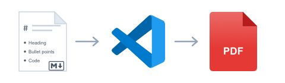
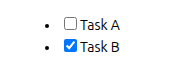
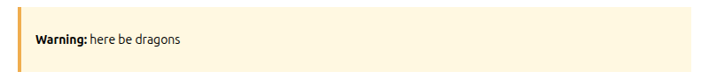
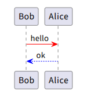
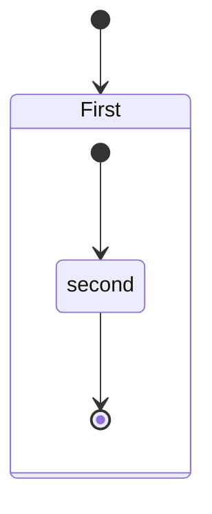
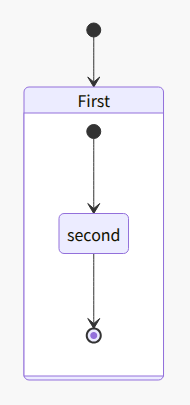
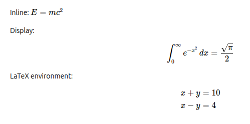

# Markdown PDF

<p>
  
</p>

This VS Code extension converts Markdown files to pdf, html, png or jpeg files.

[Japanese README](README.ja.md)

## Table of Contents
<!-- TOC depthFrom:2 depthTo:2 updateOnSave:false -->

- [What's New](#whats-new)
- [Breaking Changes](#breaking-changes)
- [Features](#features)
- [Chromium](#chromium)
- [Usage](#usage)
- [Extension Settings](#extension-settings)
- [Options](#options)
- [FAQ](#faq)
- [Known Issues](#known-issues)
- [Change Log](#change-log)
- [License](#license)
- [Sponsor](#sponsor)
- [Special thanks](#special-thanks)

<!-- /TOC -->

<div class="page"/>

## What's New

Highlights of new features and improvements since v2. See [Breaking Changes](#breaking-changes) for changes that may affect existing behavior.

### 2.2.0

- Improve error notifications with actionable hints and a Show Details button ([details](#how-do-i-troubleshoot-a-failed-export))
- Add detailed logging to the new Markdown PDF output channel ([details](#how-do-i-troubleshoot-a-failed-export))
- Add `Markdown PDF: Output Diagnostics` command for bug reports ([details](#how-do-i-troubleshoot-a-failed-export))

### 2.1.0

- Add PlantUML fenced code block support ([details](#plantuml))
- Add math rendering via KaTeX ([details](#math))
- Auto-download latest Chrome Stable ([details](#markdown-pdfchromiumautodownload))

## Breaking Changes

Changes since v2 that may affect existing behavior. See the [FAQ](#faq) section for details.

### 2.2.0

- With `markdown-pdf.sanitize: "gfm"` (default) or `"gfm-allow-style"`, block-level `<style>`, `<script>`, and `<iframe>` elements are now removed together with their content, instead of being escaped and left as visible text in the output. A notification reports what was removed during an export.
    - Details: [Why is my raw HTML being escaped or removed?](#why-is-my-raw-html-being-escaped-or-removed)

### 2.1.0

- Security hardening: To mitigate XSS-like risk ([#411](https://github.com/yzane/vscode-markdown-pdf/issues/411)), raw HTML in Markdown is now sanitized by default following the [GFM Disallowed Raw HTML extension](https://github.github.com/gfm/#disallowed-raw-html-extension-). Tags such as `<script>`, `<iframe>`, `<style>`, and `on*` / `javascript:` attributes are stripped from Markdown body content. The behavior is controlled by the new [markdown-pdf.sanitize](#markdown-pdfsanitize) setting.
    - Details: [Why is my raw HTML being escaped or removed?](#why-is-my-raw-html-being-escaped-or-removed)

### 2.0.0

- Heading IDs now follow GitHub-compatible VS Code slug generation. Existing internal anchors in your documents may change.
    - Details: [Why did my heading anchors change?](#why-did-my-heading-anchors-change)
- Highlight.js upgraded from v9 to v11. Some highlight style names have been renamed or removed.
    - Details: [Why did my syntax highlight style stop working?](#why-did-my-syntax-highlight-style-stop-working)
- Front matter parsing is now stricter. Some previously accepted formats may be rejected.
    - Details: [Why is my front matter no longer parsed?](#why-is-my-front-matter-no-longer-parsed)
- Chromium is resolved from an installed Chrome/Edge browser first, or auto-downloaded on first use.
    - Details: [How is the Chromium browser selected?](#how-is-the-chromium-browser-selected) / [Where is Chromium downloaded?](#where-is-chromium-downloaded)

## Features

Markdown PDF adds the following authoring features on top of the default Markdown renderer when converting to PDF, HTML, PNG, or JPEG.

### List

| Category | Feature | Description | Example |
|---|---|---|---|
| [Basic syntax extensions](#basic-syntax-extensions) | [Syntax highlighting](https://highlightjs.org/demo) | Code block highlighting via highlight.js | ` ```js ` |
| | [Emoji](https://www.webfx.com/tools/emoji-cheat-sheet/) | Emoji shortcodes | `:smile:` |
| | [Checkbox](#checkbox) | GitHub-style task lists | `- [ ]` / `- [x]` |
| | [Heading IDs](#heading-ids) | GitHub-compatible heading anchors | `# Heading` → `#heading` |
| [Content composition](#content-composition) | [Container](#container) | Admonition-like blocks | `::: warning` |
| | [Include](#include) | Embed Markdown fragments | `:[label](path.md)` |
| [Diagrams & math](#diagrams--math) | [PlantUML](#plantuml) | UML diagrams from code blocks | `@startuml` … `@enduml` |
| | [Mermaid](#mermaid) | Diagrams from fenced code blocks | ` ```mermaid ` |
| | [Math](#math) | LaTeX math via KaTeX | `$E = mc^2$` |

### Basic syntax extensions

#### Checkbox

Render `- [ ]` / `- [x]` task-list items as disabled checkboxes, mirroring GitHub's task list rendering. Useful for status reports and checklists that should stay visible in the exported output.

Markdown
```
- [ ] Task A
- [x] Task B
```

Preview



#### Heading IDs

Headings receive GitHub-compatible anchor IDs automatically, so internal links such as `[Section](#section)` resolve the same way they do on GitHub. ASCII headings are lowercased with spaces replaced by hyphens; non-ASCII headings keep their original characters.

| Heading | Generated ID |
|---|---|
| `# My Heading` | `#my-heading` |
| `# API Reference` | `#api-reference` |
| `# 日本語見出し` | `#日本語見出し` |

See also: [Why did my heading anchors change?](#why-did-my-heading-anchors-change) in the FAQ.

### Content composition

#### Container

Admonition-like blocks via [markdown-it-container](https://github.com/markdown-it/markdown-it-container). The identifier after `:::` becomes the block's CSS class, so you can style warnings, tips, and notes by pairing it with [markdown-pdf.styles](#markdown-pdfstyles).

Markdown
```
::: warning
**Warning:** here be dragons
:::
```

Stylesheet (for example `markdown-pdf.css`)
```css
.warning {
  border-left: 4px solid #f0ad4e;
  background: #fff8e1;
  padding: 12px 16px;
  margin: 8px 0;
}
```

Settings
```json
"markdown-pdf.styles": ["markdown-pdf.css"]
```

Preview



See also: [markdown-pdf.styles](#markdown-pdfstyles).

#### Include

Embed the content of another Markdown file inline using `:[alternate-text](relative-path-to-file.md)`. If a referenced fragment cannot be read (missing file, permission error, etc.), the extension reports the error at the include site and continues exporting the rest of the document.

Given the following directory layout (where `README.md` is the document being exported):

```
├── [plugins]
│  └── README.md
├── CHANGELOG.md
└── README.md
```

Markdown
```
README Content

:[Plugins](./plugins/README.md)

:[Changelog](CHANGELOG.md)
```

Preview
```
Content of README.md

Content of plugins/README.md

Content of CHANGELOG.md
```

See also: [markdown-pdf.markdown-it-include.enable](#markdown-pdfmarkdown-it-includeenable).

### Diagrams & math

#### PlantUML

Render UML diagrams via [PlantUML](https://plantuml.com/) using [markdown-it-plantuml](https://github.com/gmunguia/markdown-it-plantuml). Two equivalent syntaxes are supported; both produce the same `` tag and share the [markdown-pdf.plantumlServer](#markdown-pdfplantumlserver) setting.

##### Fenced code block

A ```` ```plantuml ```` fenced code block. This is the common fence convention used across the PlantUML ecosystem (for example, [GitLab renders this form natively](https://docs.gitlab.com/administration/integration/plantuml/) when the PlantUML integration is enabled).

Markdown

````
```plantuml
Bob -[#red]> Alice : hello
Alice -[#0000FF]->Bob : ok
```
````

##### Block markers

`@startuml` / `@enduml` block markers. The markers can be customized via [markdown-pdf.plantumlOpenMarker](#markdown-pdfplantumlopenmarker) and [markdown-pdf.plantumlCloseMarker](#markdown-pdfplantumlclosemarker).

Markdown

```
@startuml
Bob -[#red]> Alice : hello
Alice -[#0000FF]->Bob : ok
@enduml
```

Preview (either form produces the same image)



See also: [markdown-pdf.plantumlServer](#markdown-pdfplantumlserver).

#### Mermaid

Render diagrams from fenced code blocks via [Mermaid](https://mermaid-js.github.io/mermaid/). The Mermaid library is loaded from the URL configured in [markdown-pdf.mermaidServer](#markdown-pdfmermaidserver) (defaults to a CDN).

Markdown

<pre>

</pre>

Preview



#### Math

Render LaTeX math via [KaTeX](https://katex.org/). Uses [@vscode/markdown-it-katex](https://github.com/microsoft/vscode-markdown-it-katex) (the same plugin VS Code's built-in Markdown preview ships) for `$…$`, `$$…$$`, and `\begin{env}…\end{env}`, plus a small in-house plugin for `\(…\)` and `\[…\]` bracket delimiters. Rendering runs in Node, so no network access is required.

Supported notations:

- Inline: `$E = mc^2$`, `\(E = mc^2\)`
- Display: `$$\int_0^\infty f(x)\,dx$$`, `\[\alpha\]`
- LaTeX environments: `\begin{aligned}a &= b\\c &= d\end{aligned}`
- Fenced code block:

    ````
    ```math
    \sum_{i=1}^{n} i = \frac{n(n+1)}{2}
    ```
    ````

Markdown

<pre>
Inline: $E = mc^2$

Display:

$$\int_0^\infty e^{-x^2}\,dx = \frac{\sqrt{\pi}}{2}$$

LaTeX environment:

\begin{aligned}
x + y &= 10 \\
x - y &= 4
\end{aligned}
</pre>

Preview



See also:

- [markdown-pdf.math.enabled](#markdown-pdfmathenabled) — disable math rendering
- [markdown-pdf.math.katex.macros](#markdown-pdfmathkatexmacros) — custom KaTeX macros

### Sample files

This README converted to each output format:

- [pdf](sample/README.pdf)
- [html](sample/README.html)
- [png](sample/README.png)
- [jpeg](sample/README.jpeg)

## Chromium

Markdown PDF uses a Chromium-based browser for PDF/PNG/JPEG export. It tries the following sources in order:

1. The path specified in [markdown-pdf.executablePath](#markdown-pdfexecutablepath)
2. An installed Google Chrome, Microsoft Edge, or Chromium on your system
3. A managed Chromium automatically downloaded on first use and refreshed to track the latest Chrome Stable on subsequent VS Code launches (can be disabled with [markdown-pdf.chromium.autoDownload](#markdown-pdfchromiumautodownload))

See [How is the Chromium browser selected?](#how-is-the-chromium-browser-selected) and [Where is Chromium downloaded?](#where-is-chromium-downloaded) in the FAQ for details.

If you are behind a proxy, set the `http.proxy` option in settings.json and restart Visual Studio Code.

<div class="page"/>

## Usage

### Command Palette

1. Open the Markdown file
1. Press `F1` or `Ctrl+Shift+P`
1. Type `export` and select below
   * `markdown-pdf: Export (settings.json)`
   * `markdown-pdf: Export (pdf)`
   * `markdown-pdf: Export (html)`
   * `markdown-pdf: Export (png)`
   * `markdown-pdf: Export (jpeg)`
   * `markdown-pdf: Export (all: pdf, html, png, jpeg)`

To collect environment information for a bug report, run `Markdown PDF: Output Diagnostics`. See [How do I troubleshoot a failed export?](#how-do-i-troubleshoot-a-failed-export) in the FAQ.


### Menu

1. Open the Markdown file
1. Right click and select below
   * `markdown-pdf: Export (settings.json)`
   * `markdown-pdf: Export (pdf)`
   * `markdown-pdf: Export (html)`
   * `markdown-pdf: Export (png)`
   * `markdown-pdf: Export (jpeg)`
   * `markdown-pdf: Export (all: pdf, html, png, jpeg)`


### Auto convert

1. Add `"markdown-pdf.convertOnSave": true` option to **settings.json**
1. Restart Visual Studio Code
1. Open the Markdown file
1. Auto convert on save

## Extension Settings

[Visual Studio Code User and Workspace Settings](https://code.visualstudio.com/docs/customization/userandworkspace)

1. Select **File > Preferences > UserSettings or Workspace Settings**
1. Find markdown-pdf settings in the **Default Settings**
1. Copy `markdown-pdf.*` settings
1. Paste to the **settings.json**, and change the value


## Options

### List

|Category|Option name|[Configuration scope](https://code.visualstudio.com/api/references/contribution-points#Configuration-property-schema)|
|:---|:---|:---|
|[Save options](#save-options)|[markdown-pdf.type](#markdown-pdftype)| |
||[markdown-pdf.convertOnSave](#markdown-pdfconvertonsave)| |
||[markdown-pdf.convertOnSaveExclude](#markdown-pdfconvertonsaveexclude)| |
||[markdown-pdf.outputDirectory](#markdown-pdfoutputdirectory)| |
||[markdown-pdf.outputDirectoryRelativePathFile](#markdown-pdfoutputdirectoryrelativepathfile)| |
|[Styles options](#styles-options)|[markdown-pdf.styles](#markdown-pdfstyles)| |
||[markdown-pdf.stylesRelativePathFile](#markdown-pdfstylesrelativepathfile)| |
||[markdown-pdf.includeDefaultStyles](#markdown-pdfincludedefaultstyles)| |
|[Syntax highlight options](#syntax-highlight-options)|[markdown-pdf.highlight](#markdown-pdfhighlight)| |
||[markdown-pdf.highlightStyle](#markdown-pdfhighlightstyle)| |
|[Markdown options](#markdown-options)|[markdown-pdf.breaks](#markdown-pdfbreaks)| |
|[Emoji options](#emoji-options)|[markdown-pdf.emoji](#markdown-pdfemoji)| |
|[Configuration options](#configuration-options)|[markdown-pdf.executablePath](#markdown-pdfexecutablepath)| |
||[markdown-pdf.chromium.autoDownload](#markdown-pdfchromiumautodownload)| |
|[Common Options](#common-options)|[markdown-pdf.scale](#markdown-pdfscale)| |
|[PDF options](#pdf-options)|[markdown-pdf.displayHeaderFooter](#markdown-pdfdisplayheaderfooter)|resource|
||[markdown-pdf.headerTemplate](#markdown-pdfheadertemplate)|resource|
||[markdown-pdf.footerTemplate](#markdown-pdffootertemplate)|resource|
||[markdown-pdf.printBackground](#markdown-pdfprintbackground)|resource|
||[markdown-pdf.orientation](#markdown-pdforientation)|resource|
||[markdown-pdf.pageRanges](#markdown-pdfpageranges)|resource|
||[markdown-pdf.format](#markdown-pdfformat)|resource|
||[markdown-pdf.width](#markdown-pdfwidth)|resource|
||[markdown-pdf.height](#markdown-pdfheight)|resource|
||[markdown-pdf.margin.top](#markdown-pdfmargintop)|resource|
||[markdown-pdf.margin.bottom](#markdown-pdfmarginbottom)|resource|
||[markdown-pdf.margin.right](#markdown-pdfmarginright)|resource|
||[markdown-pdf.margin.left](#markdown-pdfmarginleft)|resource|
|[PNG JPEG options](#png-jpeg-options)|[markdown-pdf.quality](#markdown-pdfquality)| |
||[markdown-pdf.clip.x](#markdown-pdfclipx)| |
||[markdown-pdf.clip.y](#markdown-pdfclipy)| |
||[markdown-pdf.clip.width](#markdown-pdfclipwidth)| |
||[markdown-pdf.clip.height](#markdown-pdfclipheight)| |
||[markdown-pdf.omitBackground](#markdown-pdfomitbackground)| |
|[PlantUML options](#plantuml-options)|[markdown-pdf.plantumlOpenMarker](#markdown-pdfplantumlopenmarker)| |
||[markdown-pdf.plantumlCloseMarker](#markdown-pdfplantumlclosemarker)| |
||[markdown-pdf.plantumlServer](#markdown-pdfplantumlserver)| |
|[markdown-it-include options](#markdown-it-include-options)|[markdown-pdf.markdown-it-include.enable](#markdown-pdfmarkdown-it-includeenable)| |
|[mermaid options](#mermaid-options)|[markdown-pdf.mermaidServer](#markdown-pdfmermaidserver)| |
|[math options](#math-options)|[markdown-pdf.math.enabled](#markdown-pdfmathenabled)| |
||[markdown-pdf.math.katex.macros](#markdown-pdfmathkatexmacros)| |
|[Sanitize options](#sanitize-options)|[markdown-pdf.sanitize](#markdown-pdfsanitize)| |

### Save options

#### `markdown-pdf.type`
  - Output format: pdf, html, png, jpeg
  - Multiple output formats support
  - Default: pdf

```javascript
"markdown-pdf.type": [
  "pdf",
  "html",
  "png",
  "jpeg"
],
```

#### `markdown-pdf.convertOnSave`
  - Enable Auto convert on save
  - boolean. Default: false
  - To apply the settings, you need to restart Visual Studio Code

#### `markdown-pdf.convertOnSaveExclude`
  - Excluded file name of convertOnSave option

```javascript
"markdown-pdf.convertOnSaveExclude": [
  "^work",
  "work.md$",
  "work|test",
  "[0-9][0-9][0-9][0-9]-work",
  "work\\test"  // All '\' need to be written as '\\' (Windows)
],
```

#### `markdown-pdf.outputDirectory`
  - Output Directory
  - All `\` need to be written as `\\` (Windows)

```javascript
"markdown-pdf.outputDirectory": "C:\\work\\output",
```

  - Relative path
    - If you open the `Markdown file`, it will be interpreted as a relative path from the file
    - If you open a `folder`, it will be interpreted as a relative path from the root folder
    - If you open the `workspace`, it will be interpreted as a relative path from each root folder
      - See [Multi-root Workspaces](https://code.visualstudio.com/docs/editor/multi-root-workspaces)

```javascript
"markdown-pdf.outputDirectory": "output",
```

  - Relative path (home directory)
    - If path starts with  `~`, it will be interpreted as a relative path from the home directory

```javascript
"markdown-pdf.outputDirectory": "~/output",
```

  - If you set a directory with a `relative path`, it will be created if the directory does not exist
  - If you set a directory with an `absolute path`, an error occurs if the directory does not exist

#### `markdown-pdf.outputDirectoryRelativePathFile`
  - If `markdown-pdf.outputDirectoryRelativePathFile` option is set to `true`, the relative path set with [markdown-pdf.outputDirectory](#markdown-pdfoutputDirectory) is interpreted as relative from the file
  - It can be used to avoid relative paths from folders and workspaces
  - boolean. Default: false

### Styles options

#### `markdown-pdf.styles`
  - A list of local paths to the stylesheets to use from the markdown-pdf
  - If the file does not exist, it will be skipped
  - All `\` need to be written as `\\` (Windows)

```javascript
"markdown-pdf.styles": [
  "C:\\Users\\<USERNAME>\\Documents\\markdown-pdf.css",
  "/home/<USERNAME>/settings/markdown-pdf.css",
],
```

  - Relative path
    - If you open the `Markdown file`, it will be interpreted as a relative path from the file
    - If you open a `folder`, it will be interpreted as a relative path from the root folder
    - If you open the `workspace`, it will be interpreted as a relative path from each root folder
      - See [Multi-root Workspaces](https://code.visualstudio.com/docs/editor/multi-root-workspaces)

```javascript
"markdown-pdf.styles": [
  "markdown-pdf.css",
],
```

  - Relative path (home directory)
    - If path starts with `~`, it will be interpreted as a relative path from the home directory

```javascript
"markdown-pdf.styles": [
  "~/.config/Code/User/markdown-pdf.css"
],
```

  - Online CSS (https://xxx/xxx.css) is applied correctly for JPG and PNG, but problems occur with PDF [#67](https://github.com/yzane/vscode-markdown-pdf/issues/67)

```javascript
"markdown-pdf.styles": [
  "https://xxx/markdown-pdf.css"
],
```

#### `markdown-pdf.stylesRelativePathFile`

  - If `markdown-pdf.stylesRelativePathFile` option is set to `true`, the relative path set with [markdown-pdf.styles](#markdown-pdfstyles) is interpreted as relative from the file
  - It can be used to avoid relative paths from folders and workspaces
  - boolean. Default: false

#### `markdown-pdf.includeDefaultStyles`
  - Enable the inclusion of default Markdown styles (VSCode, markdown-pdf)
  - boolean. Default: true

### Syntax highlight options

#### `markdown-pdf.highlight`
  - Enable Syntax highlighting
  - boolean. Default: true

#### `markdown-pdf.highlightStyle`
  - Set the current `highlight.js` style file name. Examples: `github.css`, `monokai.css`, `base16/solarized-dark.css`
  - [file name list](https://github.com/highlightjs/highlight.js/tree/main/src/styles)
  - demo site : https://highlightjs.org/demo

```javascript
"markdown-pdf.highlightStyle": "github.css",
```

### Markdown options

#### `markdown-pdf.breaks`
  - Enable line breaks
  - boolean. Default: false

### Emoji options

#### `markdown-pdf.emoji`
  - Enable emoji. [EMOJI CHEAT SHEET](https://www.webfx.com/tools/emoji-cheat-sheet/)
  - boolean. Default: true

### Configuration options

#### `markdown-pdf.executablePath`
  - Path to a Google Chrome, Microsoft Edge, or Chromium executable to run instead of the bundled Chromium
  - See [How is the Chromium browser selected?](#how-is-the-chromium-browser-selected) in the FAQ for how this setting interacts with installed browser detection and the managed Chromium download
  - All `\` need to be written as `\\` (Windows)
  - To apply the settings, you need to restart Visual Studio Code

```javascript
"markdown-pdf.executablePath": "C:\\Program Files (x86)\\Google\\Chrome\\Application\\chrome.exe"
```

#### `markdown-pdf.chromium.autoDownload`
  - Automatically download a managed Chromium when no installed browser is found
  - boolean. Default: true
  - When `false`, Markdown PDF does not download Chromium and relies only on [markdown-pdf.executablePath](#markdown-pdfexecutablepath) or an installed Google Chrome / Microsoft Edge / Chromium. Export fails if none is available.
  - See [How is the Chromium browser selected?](#how-is-the-chromium-browser-selected) in the FAQ for the full resolution order

```javascript
"markdown-pdf.chromium.autoDownload": true
```

### Common Options

#### `markdown-pdf.scale`
  - Scale of the page rendering
  - number. Default: 1

```javascript
"markdown-pdf.scale": 1
```

### PDF options

  - pdf only. [puppeteer page.pdf options](https://github.com/puppeteer/puppeteer/blob/main/docs/api/puppeteer.pdfoptions.md)

#### `markdown-pdf.displayHeaderFooter`
  - Enables header and footer display
  - boolean. Default: true
  - Activating this option will display both the header and footer
  - If you wish to display only one of them, remove the value for the other
  - To hide the header
    ```javascript
    "markdown-pdf.headerTemplate": "",
    ```
  - To hide the footer
    ```javascript
    "markdown-pdf.footerTemplate": "",
    ```

#### `markdown-pdf.headerTemplate`
  - Specifies the HTML template for outputting the header
  - To use this option, you must set `markdown-pdf.displayHeaderFooter` to `true`
  - `<span class='date'></span>` : formatted print date. The format depends on the environment
  - `<span class='title'></span>` : markdown file name
  - `<span class='url'></span>` : markdown full path name
  - `<span class='pageNumber'></span>` : current page number
  - `<span class='totalPages'></span>` : total pages in the document
  - `%%ISO-DATETIME%%` : current date and time in ISO-based format (`YYYY-MM-DD hh:mm:ss`)
  - `%%ISO-DATE%%` : current date in ISO-based format (`YYYY-MM-DD`)
  - `%%ISO-TIME%%` : current time in ISO-based format (`hh:mm:ss`)
  - Default (version 1.5.0 and later): Displays the Markdown file name and the date using `%%ISO-DATE%%`
    ```javascript
    "markdown-pdf.headerTemplate": "<div style=\"font-size: 9px; margin-left: 1cm;\"> <span class='title'></span></div> <div style=\"font-size: 9px; margin-left: auto; margin-right: 1cm; \">%%ISO-DATE%%</div>",
    ```
  - Default (version 1.4.4 and earlier): Displays the Markdown file name and the date using `<span class='date'></span>`
    ```javascript
    "markdown-pdf.headerTemplate": "<div style=\"font-size: 9px; margin-left: 1cm;\"> <span class='title'></span></div> <div style=\"font-size: 9px; margin-left: auto; margin-right: 1cm; \"> <span class='date'></span></div>",
    ```

#### `markdown-pdf.footerTemplate`
  - Specifies the HTML template for outputting the footer
  - For more details, refer to [markdown-pdf.headerTemplate](#markdown-pdfheadertemplate)
  - Default: Displays the {current page number} / {total pages in the document}
    ```javascript
    "markdown-pdf.footerTemplate": "<div style=\"font-size: 9px; margin: 0 auto;\"> <span class='pageNumber'></span> / <span class='totalPages'></span></div>",
    ```

#### `markdown-pdf.printBackground`
  - Print background graphics
  - boolean. Default: true

#### `markdown-pdf.orientation`
  - Paper orientation
  - portrait or landscape
  - Default: portrait

#### `markdown-pdf.pageRanges`
  - Paper ranges to print, e.g., '1-5, 8, 11-13'
  - Default: all pages

```javascript
"markdown-pdf.pageRanges": "1,4-",
```

#### `markdown-pdf.format`
  - Paper format
  - Letter, Legal, Tabloid, Ledger, A0, A1, A2, A3, A4, A5, A6
  - Default: A4

```javascript
"markdown-pdf.format": "A4",
```

#### `markdown-pdf.width`
#### `markdown-pdf.height`
  - Paper width / height, accepts values labeled with units(mm, cm, in, px)
  - If it is set, it overrides the markdown-pdf.format option

```javascript
"markdown-pdf.width": "10cm",
"markdown-pdf.height": "20cm",
```

#### `markdown-pdf.margin.top`
#### `markdown-pdf.margin.bottom`
#### `markdown-pdf.margin.right`
#### `markdown-pdf.margin.left`
  - Paper margins.units(mm, cm, in, px)

```javascript
"markdown-pdf.margin.top": "1.5cm",
"markdown-pdf.margin.bottom": "1cm",
"markdown-pdf.margin.right": "1cm",
"markdown-pdf.margin.left": "1cm",
```

### PNG, JPEG options

  - png and jpeg only. [puppeteer page.screenshot options](https://github.com/puppeteer/puppeteer/blob/main/docs/api/puppeteer.screenshotoptions.md)

#### `markdown-pdf.quality`
  - jpeg only. The quality of the image, between 0-100. Not applicable to png images

```javascript
"markdown-pdf.quality": 100,
```

#### `markdown-pdf.clip.x`
#### `markdown-pdf.clip.y`
#### `markdown-pdf.clip.width`
#### `markdown-pdf.clip.height`
  - An object which specifies clipping region of the page
  - number

```javascript
//  x-coordinate of top-left corner of clip area
"markdown-pdf.clip.x": 0,

// y-coordinate of top-left corner of clip area
"markdown-pdf.clip.y": 0,

// width of clipping area
"markdown-pdf.clip.width": 1000,

// height of clipping area
"markdown-pdf.clip.height": 1000,
```

#### `markdown-pdf.omitBackground`
  - Hides default white background and allows capturing screenshots with transparency
  - boolean. Default: false

### PlantUML options

#### `markdown-pdf.plantumlOpenMarker`
  - Opening delimiter for the `@startuml` / `@enduml` block marker syntax. Change this if you want to use a different start marker.
  - Default: @startuml

#### `markdown-pdf.plantumlCloseMarker`
  - Closing delimiter for the `@startuml` / `@enduml` block marker syntax. Change this if you want to use a different end marker.
  - Default: @enduml

#### `markdown-pdf.plantumlServer`
  - Plantuml server. e.g. http://localhost:8080
  - Default: http://www.plantuml.com/plantuml
  - For example, to run Plantuml Server locally [#139](https://github.com/yzane/vscode-markdown-pdf/issues/139) :
    ```
    docker run -d -p 8080:8080 plantuml/plantuml-server:jetty
    ```
    [plantuml/plantuml-server - Docker Hub](https://hub.docker.com/r/plantuml/plantuml-server/)

### markdown-it-include options

#### `markdown-pdf.markdown-it-include.enable`
  - Enable markdown-it-include.
  - boolean. Default: true

### mermaid options

#### `markdown-pdf.mermaidServer`
  - mermaid server
  - Default: https://unpkg.com/mermaid/dist/mermaid.min.js

### math options

#### `markdown-pdf.math.enabled`
  - Enable math rendering via KaTeX for `$…$`, `$$…$$`, `\(…\)`, `\[…\]`, and ` ```math ` fenced code blocks.
  - Matches the behavior of VS Code's built-in Markdown preview.
  - Set to `false` to keep the raw `$`, `\(`, `\[`, and ` ```math ` text (use this if your document contains `$X$`-style placeholders that should not be parsed as math).
  - To disable math in a single document only, escape the `$` as `\$` at the call site, or override this setting via YAML front matter:

    ```yaml
    ---
    math:
      enabled: false
    ---
    ```
  - boolean. Default: true

#### `markdown-pdf.math.katex.macros`
  - User-defined [KaTeX macros](https://katex.org/docs/options.html) passed to the KaTeX renderer.
  - Example: `{ "\\RR": "\\mathbb{R}" }`
  - Per-document macros can be supplied via YAML front matter, which takes precedence over this setting:

    ```yaml
    ---
    math:
      katex:
        macros:
          "\\RR": "\\mathbb{R}"
    ---
    ```
  - Default: {}

### Sanitize options

#### `markdown-pdf.sanitize`
  - Sanitization mode for raw HTML in Markdown
  - `"gfm"`: Strip GFM's disallowed tags and dangerous attributes (default)
  - `"gfm-allow-style"`: Same as `"gfm"` but keeps `<style>` elements
  - `"none"`: Disable sanitization (legacy behavior, not recommended)
  - Default: `"gfm"`

```javascript
"markdown-pdf.sanitize": "gfm",
```

## FAQ

### How can I change emoji size ?

1. Add the following to your stylesheet which was specified in the markdown-pdf.styles

```css
.emoji {
  height: 2em;
}
```

### Auto guess encoding of files

Using `files.autoGuessEncoding` option of the Visual Studio Code is useful because it automatically guesses the character code. See [files.autoGuessEncoding](https://code.visualstudio.com/updates/v1_11#_auto-guess-encoding-of-files)

```javascript
"files.autoGuessEncoding": true,
```

### Output directory

If you always want to output to the relative path directory from the Markdown file.

For example, to output to the "output" directory in the same directory as the Markdown file, set it as follows.

```javascript
"markdown-pdf.outputDirectory" : "output",
"markdown-pdf.outputDirectoryRelativePathFile": true,
```

### Page Break

Please use either of the following to insert a page break.

``` html
<div class="page"/>
```

``` html
<div class="page"></div>
```

### Why did my heading anchors change?

Starting with 2.0.0, Markdown PDF generates heading IDs using a custom `markdown-it-named-headers` implementation that follows GitHub-compatible VS Code slug generation. Compared to the previous implementation, the new slug generator preserves CJK characters and underscores while removing unsupported punctuation, which can cause existing internal anchors (e.g. `#some-heading`) to resolve differently.

If your Markdown relies on specific anchor strings (for example, a table of contents or cross-document links), re-check the generated anchors after exporting and update the links as needed.

### Why did my syntax highlight style stop working?

Starting with 2.0.0, Markdown PDF uses `highlight.js` v11 (previously v9). Some style names from v9 have been renamed or removed. Markdown PDF maps legacy style names to current names where possible and shows a warning message when a configured style cannot be found. If no mapping is available, the extension falls back to `tomorrow.css`.

Please check the [available styles](https://github.com/highlightjs/highlight.js/tree/main/src/styles) and update your [markdown-pdf.highlightStyle](#markdown-pdfhighlightstyle) setting to a current style name.

### Why is my front matter no longer parsed?

Starting with 2.0.0, Markdown PDF parses YAML front matter with a custom implementation instead of `gray-matter`. The new parser is stricter and rejects the following cases that the old parser may have accepted:

- Top-level YAML sequences (arrays) as front matter
- Front matter that does not parse into a plain object
- Malformed YAML structures

A valid front matter must be a YAML mapping (object) at the top level, for example:

``` yaml
---
title: My Document
"markdown-pdf":
  displayHeaderFooter: true
---
```

BOM-prefixed files are still supported.

### Why is my raw HTML being escaped or removed?

Earlier versions of this extension passed all raw HTML in Markdown through to the renderer without validation. Tags such as `<script>` and `<iframe>` could therefore execute during preview or PDF rendering, creating XSS-like risk when opening untrusted Markdown files ([#411](https://github.com/yzane/vscode-markdown-pdf/issues/411)).

Starting with 2.1.0, raw HTML inside the Markdown body is sanitized by default per the [GFM Disallowed Raw HTML extension](https://github.github.com/gfm/#disallowed-raw-html-extension-). Behavior is controlled by `markdown-pdf.sanitize`:

| Mode | Behavior |
| --- | --- |
| `"gfm"` (default) | Strip GFM's disallowed tags and dangerous attributes. Recommended when opening Markdown files authored by others. |
| `"gfm-allow-style"` | Same as `"gfm"` but keeps `<style>` so you can embed CSS directly in a Markdown file to produce a self-contained PDF. **Use only with content you trust** — even without `<script>`, CSS can issue requests to attacker-controlled URLs via `url(...)` / `@import` / `@font-face` and leak information (known as CSS exfiltration). |
| `"none"` | Disable sanitization. Legacy behavior. Not recommended. |

**What `"gfm"` removes**

Disallowed tags:
`<title>`, `<textarea>`, `<style>`, `<xmp>`, `<iframe>`, `<noembed>`, `<noframes>`, `<script>`, `<plaintext>`

Starting with 2.2.0, block-level `<style>` / `<script>` / `<iframe>` elements are removed together with their content, so CSS or JavaScript source no longer appears as literal text in the output. All other cases — the remaining disallowed tags, and inline occurrences of any disallowed tag — have their opening `<` escaped to `&lt;` (content preserved as visible text). In 2.1.0, everything was escaped.

Attributes:
- `on*` event handlers (`onclick`, `onload`, …)
- `href` / `src` whose value starts with `javascript:`

**Sanitize notification**

Starting with 2.2.0, when elements are removed or attributes are stripped during an export, a notification summarizes what was neutralized: a toast with a "Show Details" button on manual export, or an entry in the "Markdown PDF" output channel on [Auto convert](#auto-convert).

**Migrating from inline `<style>`**

If you used to customize PDF layout by writing `<style>` directly inside a Markdown file, move that CSS into a `.css` file and reference it via `markdown-pdf.styles`. External stylesheets are loaded from your VS Code settings, not from the Markdown body, so they are not affected by sanitization.

Caveats for external CSS:

- CSS can still make outbound network requests through `@import url(...)`, `background: url(...)`, attribute selectors with `url(...)`, etc. Only reference stylesheet files you trust.
- When `markdown-pdf.stylesRelativePathFile` is `true`, the stylesheet path is resolved relative to the opened Markdown file. Be cautious about opening Markdown from untrusted locations that may ship a malicious sibling `.css`.

**Sanitization scope**

Sanitized:
- Raw HTML written inside the Markdown body (rendered via markdown-it's `html_block` / `html_inline`)
- Content pulled in by the Include feature (`:[label](path.md)`) — it goes through the same renderer

Not sanitized:
- External CSS loaded via `markdown-pdf.styles` (by design — user-configured trust boundary)
- The extension's built-in stylesheets and HTML template
- HTML emitted by the extension itself (mermaid, highlight.js, emoji, PlantUML)

### How do I troubleshoot a failed export?

Starting with 2.2.0, the extension writes detailed logs to the **Markdown PDF** output channel. Open it via **View** > **Output** and select **Markdown PDF** in the dropdown.

- When an export fails, the error toast describes what failed and, for common causes (Chromium launch failure, locked output file, permission denied, disk full, invalid output directory), adds a one-line hint. The **Show Details** button opens the log with the full context, error message, and stack trace.
- Every export logs an environment snapshot and conversion context block at the start, so the log alone is usually enough to see what happened.
- Run `Markdown PDF: Output Diagnostics` from the Command Palette to print environment and configuration diagnostics: extension version, VS Code / OS information, the Chromium path and how it was selected, and relevant settings. Home directory paths are masked.

When filing an issue, please attach the output of `Markdown PDF: Output Diagnostics` and the log shown by **Show Details**.

### How is the Chromium browser selected?

Markdown PDF resolves a Chromium-based browser in the following order:

1. The path specified in [markdown-pdf.executablePath](#markdown-pdfexecutablepath), if the file exists.
2. An installed browser on your system. Google Chrome (stable) is detected via [@puppeteer/browsers](https://pptr.dev/browsers-api) at its standard OS install location; Microsoft Edge and Chromium are probed at the fixed paths listed below.
3. A managed Chromium that Markdown PDF automatically downloads on first use.

The first match wins. The per-OS scan order for installed Edge and Chromium is:

**Windows**

1. Google Chrome (stable install, detected via `@puppeteer/browsers`)
2. `%LOCALAPPDATA%\Microsoft\Edge\Application\msedge.exe`
3. `%LOCALAPPDATA%\Chromium\Application\chrome.exe`
4. `%PROGRAMFILES%\Microsoft\Edge\Application\msedge.exe`
5. `%PROGRAMFILES%\Chromium\Application\chrome.exe`
6. `%PROGRAMFILES(X86)%\Microsoft\Edge\Application\msedge.exe`
7. `%PROGRAMFILES(X86)%\Chromium\Application\chrome.exe`

**macOS**

1. Google Chrome (stable install, detected via `@puppeteer/browsers`)
2. `/Applications/Chromium.app/Contents/MacOS/Chromium`
3. `/Applications/Microsoft Edge.app/Contents/MacOS/Microsoft Edge`

**Linux**

1. Google Chrome (stable install, detected via `@puppeteer/browsers`)
2. `/usr/bin/chromium-browser`
3. `/usr/bin/chromium`
4. `/usr/bin/microsoft-edge`
5. `/usr/bin/microsoft-edge-stable`

### Where is Chromium downloaded?

If no installed browser is found, Markdown PDF downloads a managed Chromium on first use. The download is stored under the extension's VS Code global storage directory:

| OS | Download path |
| --- | --- |
| Windows | `%APPDATA%\Code\User\globalStorage\yzane.markdown-pdf\` |
| macOS | `~/Library/Application Support/Code/User/globalStorage/yzane.markdown-pdf/` |
| Linux | `~/.config/Code/User/globalStorage/yzane.markdown-pdf/` |

If you use VS Code Insiders or VSCodium, the base path changes accordingly (for example `Code - Insiders` or `VSCodium` instead of `Code`).

During the download, `Installing Chromium` is shown in the status bar.

**Which Chromium build is downloaded?**

Markdown PDF tries to fetch the latest Chrome Stable build id from the [Chrome for Testing API](https://googlechromelabs.github.io/chrome-for-testing/last-known-good-versions.json). The latest build id is checked once per VS Code session: when a newer Chrome Stable has been released, Markdown PDF downloads the new build at the next export and removes the previously cached build. Within the same VS Code session the build id is memoized — restart VS Code to pick up a freshly released build.

If the API is unreachable, it falls back in this order:

1. The most recently cached build under the global storage directory shown above
2. The build id pinned by the bundled `puppeteer-core` (last-resort fallback)

**Disabling the auto-download**

Set [markdown-pdf.chromium.autoDownload](#markdown-pdfchromiumautodownload) to `false` to skip the download entirely. Markdown PDF will then rely only on [markdown-pdf.executablePath](#markdown-pdfexecutablepath) or an installed Google Chrome / Microsoft Edge / Chromium, and export will fail with an error if none is available.

<div class="page"/>

## Known Issues

### `markdown-pdf.styles` option
* Online CSS (https://xxx/xxx.css) is applied correctly for JPG and PNG, but problems occur with PDF. [#67](https://github.com/yzane/vscode-markdown-pdf/issues/67)


## [Change Log](CHANGELOG.md)

See [CHANGELOG.md](CHANGELOG.md) for the full change history.

## License

MIT


## Sponsor

If you find Markdown PDF useful, you can support continued development via [GitHub Sponsors](https://github.com/sponsors/yzane).


## Special thanks
* [puppeteer/puppeteer](https://github.com/puppeteer/puppeteer)
* [markdown-it/markdown-it](https://github.com/markdown-it/markdown-it)
* [markdown-it/markdown-it-emoji](https://github.com/markdown-it/markdown-it-emoji)
* [HenrikJoreteg/emoji-images](https://github.com/HenrikJoreteg/emoji-images)
* [highlightjs/highlight.js](https://github.com/highlightjs/highlight.js)
* [markdown-it/markdown-it-container](https://github.com/markdown-it/markdown-it-container)
* [gmunguia/markdown-it-plantuml](https://github.com/gmunguia/markdown-it-plantuml)
* [mermaid-js/mermaid](https://github.com/mermaid-js/mermaid)
* [KaTeX/KaTeX](https://github.com/KaTeX/KaTeX)
* [microsoft/vscode-markdown-it-katex](https://github.com/microsoft/vscode-markdown-it-katex)
