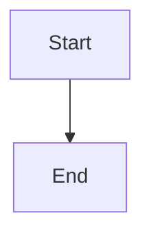

# インテグレーションテスト実装計画

> **For agentic workers:** REQUIRED SUB-SKILL: Use superpowers:subagent-driven-development (recommended) or superpowers:executing-plans to implement this plan task-by-task. Steps use checkbox (`- [ ]`) syntax for tracking.

**Goal:** テスト実行基盤を `@vscode/test-cli` に移行し、`test/integration/` にHTMLスナップショット比較とバイナリ生成検証によるインテグレーションテストを実装する。

**Architecture:** `.vscode-test.mjs` にプラットフォーム検出ロジック（VS Codeパス検出、WSL2 UNCパス変換）を集約し、旧ボイラープレート（`test/runTest.js`、`test/suite/index.js`）を廃止する。テストコードは `test/integration/` 配下に機能ごとのフィクスチャとHTMLスナップショットを配置する。

**Tech Stack:** `@vscode/test-cli` ^0.0.12, `@vscode/test-electron` ^2.4.0, Mocha (TDD), VS Code Extension API

**前提:** ユニットテスト計画が完了済みであること（`src/utils.js` 抽出、mocha ^11 インストール、`test:unit` スクリプト追加済み）。

**設計ドキュメント:** `docs/superpowers/specs/2026-03-30-integration-tests-design.md`

---

### Task 1: package.json の devDependencies 更新

**ファイル:**
- 変更: `package.json`

- [ ] **Step 1: 旧パッケージをアンインストール**

```bash
npm uninstall glob vscode-test
```

期待: `glob` と `vscode-test` が `package.json` の devDependencies から削除される。

- [ ] **Step 2: 新パッケージをインストール**

```bash
npm install --save-dev @vscode/test-cli @vscode/test-electron
```

期待: `@vscode/test-cli` と `@vscode/test-electron` が devDependencies に追加される。

- [ ] **Step 3: devDependencies を確認**

```bash
node -e "const p = require('./package.json'); console.log(JSON.stringify(p.devDependencies, null, 2))"
```

期待: 以下のパッケージが存在し、`glob` と `vscode-test` が存在しないこと。
- `@vscode/test-cli`
- `@vscode/test-electron`
- `mocha` (^11.0.0)
- `removeNPMAbsolutePaths` (既存、変更なし)

- [ ] **Step 4: コミット**

```bash
git add package.json package-lock.json
git commit -m "chore: migrate devDependencies to @vscode/test-cli"
```

---

### Task 2: .vscode-test.mjs の作成と test スクリプト更新

**ファイル:**
- 新規作成: `.vscode-test.mjs`
- 変更: `package.json`

- [ ] **Step 1: `.vscode-test.mjs` を作成**

```javascript
import { defineConfig } from '@vscode/test-cli';
import fs from 'fs';
import path from 'path';
import os from 'os';
import { execSync } from 'child_process';
import { fileURLToPath } from 'url';

const __dirname = path.dirname(fileURLToPath(import.meta.url));

// WSL2 detection: check for Windows VS Code via /mnt/c
const WINDOWS_VSCODE_PATH = '/mnt/c/Program Files/Microsoft VS Code/Code.exe';
const isWSL2 = fs.existsSync(WINDOWS_VSCODE_PATH);

/**
 * Detect an existing VS Code installation on the current platform.
 * Returns the executable path if found, or null to let @vscode/test-cli download one.
 */
function detectVSCodePath() {
  const candidates = [];

  if (isWSL2) {
    candidates.push(WINDOWS_VSCODE_PATH);
  } else if (process.platform === 'win32') {
    candidates.push(
      path.join(process.env.LOCALAPPDATA || '', 'Programs/Microsoft VS Code/Code.exe'),
      'C:\\Program Files\\Microsoft VS Code\\Code.exe'
    );
  } else if (process.platform === 'darwin') {
    candidates.push('/Applications/Visual Studio Code.app/Contents/MacOS/Electron');
  } else {
    // Linux
    candidates.push('/usr/share/code/code', '/usr/bin/code');
  }

  return candidates.find(p => fs.existsSync(p)) || null;
}

/**
 * Build WSL2-specific options: UNC path conversion, user-data-dir with
 * allowed UNC hosts, and Chrome executable path for Puppeteer.
 */
function buildWSL2Options() {
  const toUncPath = (p) => execSync(`wslpath -w "${p}"`).toString().trim();
  const chromePath = 'C:\\Program Files\\Google\\Chrome\\Application\\chrome.exe';

  // Temporary user-data-dir with UNC host allowed and Chrome path configured
  const tmpUserDataDir = path.join(os.tmpdir(), 'vscode-test-userdata');
  const settingsDir = path.join(tmpUserDataDir, 'User');
  fs.mkdirSync(settingsDir, { recursive: true });
  fs.writeFileSync(path.join(settingsDir, 'settings.json'), JSON.stringify({
    'security.allowedUNCHosts': ['wsl.localhost'],
    'security.workspace.trust.enabled': false,
    'markdown-pdf.executablePath': chromePath
  }));

  return {
    extensionDevelopmentPath: toUncPath(__dirname),
    launchArgs: ['--user-data-dir=' + toUncPath(tmpUserDataDir)],
  };
}

const vscodePath = detectVSCodePath();
const installationOption = vscodePath ? { useInstallation: { fromPath: vscodePath } } : {};
const wsl2Options = isWSL2 ? buildWSL2Options() : {};

export default defineConfig([
  {
    label: 'integration',
    files: 'test/integration/**/*.test.js',
    mocha: { ui: 'tdd', timeout: 60000 },
    ...installationOption,
    ...wsl2Options,
  },
]);
```

- [ ] **Step 2: 設定ファイルの構文を確認**

```bash
node --input-type=module -e "import('./.vscode-test.mjs').then(m => console.log(JSON.stringify(m.default, null, 2)))"
```

期待: JSON形式で設定が出力される。`label: "integration"` と `files` パターンが含まれること。

- [ ] **Step 3: `package.json` の `test` スクリプトを更新**

`package.json` の `scripts` セクションを以下に変更:

```json
"scripts": {
  "vscode:prepublish": "node ./src/compile",
  "test": "vscode-test",
  "test:unit": "mocha test/unit/**/*.test.js"
},
```

変更点: `"test": "node ./test/runTest.js"` → `"test": "vscode-test"`

- [ ] **Step 4: ユニットテストが引き続き動作することを確認**

```bash
npm run test:unit
```

期待: 41 テストケースが全て PASS。

- [ ] **Step 5: コミット**

```bash
git add .vscode-test.mjs package.json
git commit -m "feat: add .vscode-test.mjs and update test script for @vscode/test-cli"
```

---

### Task 3: フィクスチャ Markdown ファイルの作成

**ファイル:**
- 新規作成: `test/integration/fixtures/syntax-highlighting.md`
- 新規作成: `test/integration/fixtures/emoji.md`
- 新規作成: `test/integration/fixtures/checkbox.md`
- 新規作成: `test/integration/fixtures/container.md`
- 新規作成: `test/integration/fixtures/include.md`
- 新規作成: `test/integration/fixtures/include-target.md`
- 新規作成: `test/integration/fixtures/plantuml.md`
- 新規作成: `test/integration/fixtures/mermaid.md`

- [ ] **Step 1: ディレクトリ作成**

```bash
mkdir -p test/integration/fixtures test/integration/expected
```

- [ ] **Step 2: syntax-highlighting.md を作成**

```markdown
# Syntax Highlighting

```javascript
function hello() {
  console.log("Hello, World!");
}
```

```python
def hello():
    print("Hello, World!")
```
```

- [ ] **Step 3: emoji.md を作成**

```markdown
# Emoji

:smile: :+1: :heart:
```

- [ ] **Step 4: checkbox.md を作成**

```markdown
# Checkbox

- [ ] unchecked
- [x] checked
```

- [ ] **Step 5: container.md を作成**

```markdown
# Container

::: warning
*here be dragons*
:::

::: note
This is a note.
:::
```

- [ ] **Step 6: include.md と include-target.md を作成**

`include.md`:
```markdown
# Include

:[include-target](include-target.md)
```

`include-target.md`:
```markdown
This content is included from another file.
```

- [ ] **Step 7: plantuml.md を作成**

```markdown
# PlantUML

@startuml
Bob -> Alice : hello
Alice -> Bob : ok
@enduml
```

- [ ] **Step 8: mermaid.md を作成**

```markdown
# Mermaid


```

- [ ] **Step 9: コミット**

```bash
git add test/integration/fixtures/
git commit -m "test: add integration test fixture markdown files for all features"
```

---

### Task 4: インテグレーションテストファイルの作成

**ファイル:**
- 新規作成: `test/integration/extension.test.js`

- [ ] **Step 1: テストファイルを作成**

`test/integration/extension.test.js`:
```javascript
'use strict';

const assert = require('assert');
const path = require('path');
const fs = require('fs');
const vscode = require('vscode');

const FIXTURES_DIR = path.resolve(__dirname, 'fixtures');
const EXPECTED_DIR = path.resolve(__dirname, 'expected');

/**
 * Normalize environment-dependent content in generated HTML.
 * - Replace file:/// URIs with a fixed placeholder
 * - Replace ISO date patterns (YYYY-MM-DD) with a fixed value
 * - Replace time patterns (HH:MM:SS) with a fixed value
 */
function normalizeHtml(html) {
  return html
    .replace(/file:\/\/\/[^\s"'<>]*/g, 'file:///NORMALIZED_PATH')
    .replace(/\d{4}-\d{2}-\d{2}/g, 'YYYY-MM-DD')
    .replace(/\d{2}:\d{2}:\d{2}/g, 'HH:MM:SS');
}

/**
 * Open the specified Markdown file and execute the given command.
 */
async function executeMarkdownPdfCommand(mdFileName, command) {
  const mdPath = path.resolve(FIXTURES_DIR, mdFileName);
  const doc = await vscode.workspace.openTextDocument(mdPath);
  await vscode.window.showTextDocument(doc);
  await vscode.commands.executeCommand(command);
  // Wait for async file write after command completion
  await new Promise(resolve => setTimeout(resolve, 2000));
}

/**
 * Wait until the file exists, up to maxWait milliseconds.
 */
function waitForFile(filePath, maxWait = 30000) {
  return new Promise((resolve, reject) => {
    if (fs.existsSync(filePath)) return resolve();
    const interval = 500;
    let waited = 0;
    const timer = setInterval(() => {
      waited += interval;
      if (fs.existsSync(filePath)) {
        clearInterval(timer);
        resolve();
      } else if (waited >= maxWait) {
        clearInterval(timer);
        reject(new Error(`File not found after ${maxWait}ms: ${filePath}`));
      }
    }, interval);
  });
}

/**
 * Safely delete a file (ignore if it does not exist).
 */
function safeDelete(filePath) {
  try {
    if (fs.existsSync(filePath)) {
      fs.unlinkSync(filePath);
    }
  } catch (e) {
    // ignore
  }
}

// PlantUML first: its markdown-it plugin may spawn java asynchronously on first load,
// causing an uncaught ENOENT error. Running it first keeps that error in its own test.
const HTML_FEATURES = [
  'plantuml',
  'syntax-highlighting',
  'emoji',
  'checkbox',
  'container',
  'include',
  'mermaid',
];

suite('Integration HTML Snapshot Tests', () => {
  // Suppress uncaught errors from markdown-it-plantuml spawning java asynchronously.
  // The plugin tries to spawn java even when using the server-side rendering mode,
  // and the ENOENT error surfaces as an uncaught exception that Mocha catches.
  const originalListeners = [];
  suiteSetup(function () {
    originalListeners.push(...process.listeners('uncaughtException'));
    process.removeAllListeners('uncaughtException');
    process.on('uncaughtException', (err) => {
      if (err.message && err.message.includes('spawn java ENOENT')) {
        return; // suppress PlantUML java spawn error
      }
      throw err;
    });
  });
  suiteTeardown(function () {
    process.removeAllListeners('uncaughtException');
    originalListeners.forEach((listener) => process.on('uncaughtException', listener));
  });

  HTML_FEATURES.forEach((feature) => {
    test(`${feature}: HTML snapshot matches expected`, async function () {
      this.timeout(60000);

      const mdFile = `${feature}.md`;
      const ext = path.extname(mdFile);
      const baseName = path.basename(mdFile, ext);
      const generatedHtmlPath = path.resolve(FIXTURES_DIR, `${baseName}.html`);

      try {
        await executeMarkdownPdfCommand(mdFile, 'extension.markdown-pdf.html');
        await waitForFile(generatedHtmlPath);

        const generatedHtml = normalizeHtml(fs.readFileSync(generatedHtmlPath, 'utf-8'));
        const expectedHtmlPath = path.resolve(EXPECTED_DIR, `${baseName}.html`);
        const expectedHtml = fs.readFileSync(expectedHtmlPath, 'utf-8');

        assert.strictEqual(generatedHtml, expectedHtml);
      } finally {
        safeDelete(generatedHtmlPath);
      }
    });
  });
});

suite('Integration Binary Generation Tests', () => {
  const COMBINED_MD = path.resolve(FIXTURES_DIR, '_combined.md');
  const COMBINED_BASE = path.resolve(FIXTURES_DIR, '_combined');

  suiteSetup(function () {
    // Concatenate all fixture Markdown files
    const contents = HTML_FEATURES.map((feature) => {
      const filePath = path.resolve(FIXTURES_DIR, `${feature}.md`);
      return fs.readFileSync(filePath, 'utf-8');
    });
    fs.writeFileSync(COMBINED_MD, contents.join('\n\n---\n\n'), 'utf-8');
  });

  suiteTeardown(function () {
    safeDelete(COMBINED_MD);
  });

  const BINARY_FORMATS = [
    {
      type: 'pdf',
      command: 'extension.markdown-pdf.pdf',
      // %PDF (25 50 44 46)
      magicBytes: Buffer.from([0x25, 0x50, 0x44, 0x46]),
    },
    {
      type: 'png',
      command: 'extension.markdown-pdf.png',
      // PNG header (89 50 4E 47)
      magicBytes: Buffer.from([0x89, 0x50, 0x4E, 0x47]),
    },
    {
      type: 'jpeg',
      command: 'extension.markdown-pdf.jpeg',
      // JPEG header (FF D8 FF)
      magicBytes: Buffer.from([0xFF, 0xD8, 0xFF]),
    },
  ];

  BINARY_FORMATS.forEach(({ type, command, magicBytes }) => {
    test(`${type.toUpperCase()}: generates valid file`, async function () {
      this.timeout(60000);

      const outputPath = `${COMBINED_BASE}.${type}`;

      try {
        await executeMarkdownPdfCommand('_combined.md', command);
        await waitForFile(outputPath);

        const stat = fs.statSync(outputPath);
        assert.ok(stat.size > 0, `${type} file should not be empty`);

        const header = Buffer.alloc(magicBytes.length);
        const fd = fs.openSync(outputPath, 'r');
        fs.readSync(fd, header, 0, magicBytes.length, 0);
        fs.closeSync(fd);

        assert.ok(
          header.equals(magicBytes),
          `${type} magic bytes mismatch: expected ${magicBytes.toString('hex')}, got ${header.toString('hex')}`
        );
      } finally {
        safeDelete(outputPath);
      }
    });
  });
});
```

- [ ] **Step 2: 構文チェック**

```bash
node -c test/integration/extension.test.js
```

期待: エラーなし

- [ ] **Step 3: コミット**

```bash
git add test/integration/extension.test.js
git commit -m "test: add integration test suite for HTML snapshots and binary generation"
```

---

### Task 5: 旧テストインフラの削除

**ファイル:**
- 削除: `test/runTest.js`
- 削除: `test/suite/extension.test.js`
- 削除: `test/suite/mermaid.md`
- 削除: `test/suite/index.js`
- 削除: `test/suite/` (空ディレクトリ)

- [ ] **Step 1: 旧ファイルを削除**

```bash
rm test/runTest.js
rm test/suite/extension.test.js
rm test/suite/mermaid.md
rm test/suite/index.js
rmdir test/suite
```

- [ ] **Step 2: ユニットテストが影響を受けていないことを確認**

```bash
npm run test:unit
```

期待: 41 テストケースが全て PASS。

- [ ] **Step 3: コミット**

```bash
git add -u test/runTest.js test/suite/
git commit -m "chore: remove legacy test runner and old test files"
```

---

### Task 6: 初回テスト実行とスナップショット生成

**ファイル:**
- 新規作成: `test/integration/expected/*.html`（7 ファイル）

- [ ] **Step 1: テストを実行して初回の HTML を生成**

初回実行時はまだ `expected/` に期待 HTML がないためテストは失敗する。テストファイル内の `assert.strictEqual` 行を一時的にコメントアウトし、代わりに正規化済み HTML を `expected/` に書き出すコードを追加:

```javascript
// Temporarily used instead of assert.strictEqual
fs.writeFileSync(expectedHtmlPath, generatedHtml, 'utf-8');
```

テスト実行:

```bash
npm test
```

`expected/` 配下に 7 つの HTML ファイルが生成されたことを確認:

```bash
ls test/integration/expected/
```

期待: `checkbox.html container.html emoji.html include.html mermaid.html plantuml.html syntax-highlighting.html`

- [ ] **Step 2: テストコードを元に戻す**

Step 1 で一時的に追加した書き出しコードを削除し、`assert.strictEqual` を元に戻す。

- [ ] **Step 3: テストを再実行して全パスを確認**

```bash
npm test
```

期待: 全 10 テスト（HTML 7 + バイナリ 3）がパス

- [ ] **Step 4: 生成された期待 HTML の内容を目視確認**

各 `expected/*.html` を開き、以下を確認:
- `syntax-highlighting.html`: `hljs` クラスを持つ `<code>` 要素が含まれる
- `emoji.html`: base64 エンコードされた emoji 画像が含まれる
- `checkbox.html`: `<input type="checkbox">` が含まれる
- `container.html`: `<div class="warning">` と `<div class="note">` が含まれる
- `include.html`: "This content is included from another file." が含まれる
- `plantuml.html`: PlantUML サーバー URL を持つ `` が含まれる
- `mermaid.html`: `<div class="mermaid">` が含まれる

- [ ] **Step 5: コミット**

```bash
git add test/integration/expected/ test/integration/extension.test.js
git commit -m "test: complete integration test implementation with all snapshots"
```

---

### Task 7: 最終検証

**ファイル:** なし（検証のみ）

- [ ] **Step 1: 全テスト（ユニット + インテグレーション）の最終確認**

```bash
npm run test:unit && npm test
```

期待: ユニットテスト 41件 PASS、インテグレーションテスト 10件 PASS。

- [ ] **Step 2: ディレクトリ構成の確認**

```bash
find test -type f | sort
```

期待される構成:
```
test/integration/expected/checkbox.html
test/integration/expected/container.html
test/integration/expected/emoji.html
test/integration/expected/include.html
test/integration/expected/mermaid.html
test/integration/expected/plantuml.html
test/integration/expected/syntax-highlighting.html
test/integration/extension.test.js
test/integration/fixtures/checkbox.md
test/integration/fixtures/container.md
test/integration/fixtures/emoji.md
test/integration/fixtures/include-target.md
test/integration/fixtures/include.md
test/integration/fixtures/mermaid.md
test/integration/fixtures/plantuml.md
test/integration/fixtures/syntax-highlighting.md
test/unit/utils.test.js
```

旧ファイル（`test/runTest.js`、`test/suite/`）が存在しないこと。
