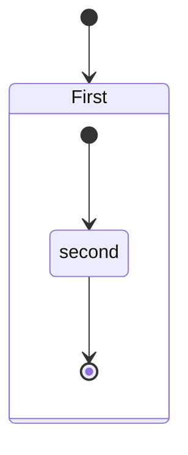

# README「機能」節の再設計 実装プラン

> **For agentic workers:** REQUIRED SUB-SKILL: Use superpowers:subagent-driven-development (recommended) or superpowers:executing-plans to implement this plan task-by-task. Steps use checkbox (`- [ ]`) syntax for tracking.

**Goal:** README.md / README.ja.md の `## Features` 節を、カテゴリ H3 × 3 + 機能 H4 × 7 + Sample files H3 の骨格に再構成し、説明プロズと OUTPUT 表現（画像化）を揃える。

**Architecture:** 既存のヘルパー `src/readme-diagrams.ts` と生成スクリプト `test/sample/update-readme-diagrams.ts` を previews へリネーム・拡張し、Checkbox / Container / Math の PNG を追加生成できるようにする。README 本文はカテゴリ別小テーブル 3 本 + 統一テンプレートで書き直し、Math 節から溢れる設定・マクロ情報は Options の既存設定項目説明へ吸収する。アンカー ID は H3 → H4 のレベル変更でも保持されるため、既存アンカーは壊れない。

**Tech Stack:** TypeScript / Markdown / markdown-it-plantuml / markdown-it-container / @vscode/markdown-it-katex / mocha (`tsx --test` + `@vscode/test-cli`)

**Branch:** `feature/readme-features-redesign`（`.worktrees/readme-features-redesign` の worktree）。全作業はこのブランチ上で行うこと。`develop` / `master` には直接コミットしないこと。

**Spec:** `docs/superpowers/specs/20260421-01-readme-features-redesign-design.md`

---

## 事前確認

- [ ] **Step 0a: 作業ブランチを確認**

```bash
git branch --show-current
```
期待出力: `feature/readme-features-redesign`

- [ ] **Step 0b: 作業 worktree を確認**

```bash
pwd
```
期待出力末尾: `/.worktrees/readme-features-redesign`

- [ ] **Step 0c: ビルドが通ることを確認**

```bash
npm run check
npm run test:unit
```
期待: `check` 成功、`test:unit` 既存テストがすべてパス。

---

## Task 1: ヘルパー `src/readme-diagrams.ts` を `src/readme-previews.ts` にリネーム（純粋な refactor）

**Files:**
- Rename: `src/readme-diagrams.ts` → `src/readme-previews.ts`
- Rename: `test/unit/readme-diagrams.test.ts` → `test/unit/readme-previews.test.ts`
- Modify: `test/sample/update-readme-diagrams.ts`（import パスだけ更新。ファイル本体のリネームは Task 2 で）

**目的:** 命名を previews に寄せる純粋なリネーム。ロジックは一切変更しない。関数名は以下に変える。

- `extractReadmeDiagramSources` → `extractReadmePreviewSources`
- `resolveReadmeDiagramExportPath` → `resolveReadmePreviewExportPath`
- それ以外の export (`extractReadmeSection` / `extractFirstFencedBlock` / `buildPlantumlImageUrl` / `buildMermaidRenderHtml`) は名前変更不要

- [ ] **Step 1.1: ソースをリネームし関数名を変更**

```bash
git mv src/readme-diagrams.ts src/readme-previews.ts
```

`src/readme-previews.ts` を開き、関数名を変更する（`extractReadmeDiagramSources` → `extractReadmePreviewSources`、`resolveReadmeDiagramExportPath` → `resolveReadmePreviewExportPath`）。関数本体のロジックは触らない。

- [ ] **Step 1.2: 単体テストをリネームし、import と describe 名を更新**

```bash
git mv test/unit/readme-diagrams.test.ts test/unit/readme-previews.test.ts
```

`test/unit/readme-previews.test.ts` 冒頭の import を次のように更新:

```ts
import {
  buildMermaidRenderHtml,
  buildPlantumlImageUrl,
  extractFirstFencedBlock,
  extractReadmePreviewSources,
  extractReadmeSection,
  resolveReadmePreviewExportPath,
} from '../../src/readme-previews';
```

続けてファイル中の以下 2 箇所を置換:

- `describe('readme-diagrams', function () {` → `describe('readme-previews', function () {`
- `extractReadmeDiagramSources(README_SNIPPET)` → `extractReadmePreviewSources(README_SNIPPET)`
- `resolveReadmeDiagramExportPath(` → `resolveReadmePreviewExportPath(`（3 箇所）

テスト本体の assert 内容は**一切変更しない**（この Task では API の改修は扱わない）。

- [ ] **Step 1.3: `test/sample/update-readme-diagrams.ts` の import を更新**

該当行（現 L7）:
```ts
import { extractReadmeDiagramSources, resolveReadmeDiagramExportPath } from '../../src/readme-diagrams';
```

次に置換:
```ts
import { extractReadmePreviewSources, resolveReadmePreviewExportPath } from '../../src/readme-previews';
```

ファイル内の `extractReadmeDiagramSources(markdown)` と `resolveReadmeDiagramExportPath(` の呼び出し箇所も同様に新名へ置換する。

- [ ] **Step 1.4: 単体テストを実行して全通過を確認**

```bash
npm run test:unit
```
期待: 既存テストがすべてパス（新規追加なし）。

- [ ] **Step 1.5: 型チェックを実行**

```bash
npm run check
```
期待: 成功（TypeScript 型エラーなし）。

- [ ] **Step 1.6: コミット**

```bash
git add -A src/readme-previews.ts test/unit/readme-previews.test.ts test/sample/update-readme-diagrams.ts
git add src/readme-diagrams.ts test/unit/readme-diagrams.test.ts 2>/dev/null || true  # for rename tracking
git status
git commit -m "$(cat <<'EOF'
refactor: rename readme-diagrams module to readme-previews

Pure rename ahead of expanding the helper to cover checkbox,
container, and math previews. No behavioral changes.

Co-Authored-By: Claude Opus 4.7 <noreply@anthropic.com>
EOF
)"
```

---

## Task 2: サンプル生成スクリプトを `update-readme-previews.ts` にリネーム + 関連設定を更新

**Files:**
- Rename: `test/sample/update-readme-diagrams.ts` → `test/sample/update-readme-previews.ts`
- Modify: `.vscode-test.mjs`
- Modify: `package.json`

**目的:** テストスクリプトファイル本体と、それを参照する `.vscode-test.mjs` のラベル・ファイルパス、`package.json` のスクリプト名を揃える。

- [ ] **Step 2.1: テストスクリプトをリネーム**

```bash
git mv test/sample/update-readme-diagrams.ts test/sample/update-readme-previews.ts
```

ファイル内の `suite('Update README Diagram Images', ...)` を `suite('Update README Preview Images', ...)` に変更する（以降新画像も扱うため）。

- [ ] **Step 2.2: `.vscode-test.mjs` の該当設定を更新**

現行該当ブロック:
```js
  {
    label: 'readme-diagrams',
    files: 'test/sample/update-readme-diagrams.ts',
    mocha: { ui: 'tdd', timeout: 120000, require: ['tsx'] },
    skipExtensionDependencies: true,
    launchArgs,
    ...installationOption,
  },
```

次に置換:
```js
  {
    label: 'readme-previews',
    files: 'test/sample/update-readme-previews.ts',
    mocha: { ui: 'tdd', timeout: 120000, require: ['tsx'] },
    skipExtensionDependencies: true,
    launchArgs,
    ...installationOption,
  },
```

- [ ] **Step 2.3: `package.json` の scripts を更新**

現行:
```json
    "preupdate-readme-diagrams": "npm run build",
    "update-readme-diagrams": "vscode-test --config .vscode-test.mjs --label readme-diagrams",
```

次に置換:
```json
    "preupdate-readme-previews": "npm run build",
    "update-readme-previews": "vscode-test --config .vscode-test.mjs --label readme-previews",
```

- [ ] **Step 2.4: 型チェックと既存ユニットテストで回帰を確認**

```bash
npm run check
npm run test:unit
```
期待: 両方成功。

- [ ] **Step 2.5: コミット**

```bash
git add -A
git status
git commit -m "$(cat <<'EOF'
refactor: rename update-readme-diagrams sample script to previews

Matches the earlier rename of the helper module. No behavior
change yet -- the script still exports only PlantUML and mermaid.

Co-Authored-By: Claude Opus 4.7 <noreply@anthropic.com>
EOF
)"
```

> **注意:** この時点で `npm run update-readme-previews` を実行して PlantUML.png / mermaid.png の再生成が従来どおり動くことを確認したいが、vscode-test は VS Code 実体のダウンロードや WSL 上の制約があるため、**本プランでは Task 8（画像再生成）までスクリプト実行を遅延する**。型チェックと単体テストが通っていれば本 Task は完了とみなす。

---

## Task 3: README.md の `## Features` 節を再構成

**Files:**
- Modify: `README.md` (L64-283 付近を全面書き直し)

**目的:** カテゴリ H3 × 3 + 機能 H4 × 7 + Sample files H3 の骨格で書き直す。画像参照 (`images/checkbox.png` / `container.png` / `math.png`) はまだ存在しないが、Task 8 で生成されるためリンクだけ先に記述する。

- [ ] **Step 3.1: 現行 Features 節の範囲を特定**

```bash
grep -n "^## " README.md | head -20
```
期待: `## Features`（現 L64 付近）と、次の `## Chromium`（現 L285 付近）が見える。この 2 つの H2 の間（`## Features` 行を含み `## Chromium` 行の直前まで）を次の Step で置換する。

- [ ] **Step 3.2: Features 節を全置換**

`## Features` 行から次 H2 (`## Chromium`) の直前までを、次の内容に置換する。

````markdown
## Features

Markdown PDF adds the following authoring features on top of the default Markdown renderer when converting to PDF, HTML, PNG, or JPEG.

### Basic syntax extensions

| Feature | Description | Example |
|---|---|---|
| [Syntax highlighting](https://highlightjs.org/demo) | Code block highlighting via highlight.js | ` ```js ` |
| [Emoji](https://www.webfx.com/tools/emoji-cheat-sheet/) | Emoji shortcodes | `:smile:` |
| [Checkbox](#checkbox) | GitHub-style task lists | `- [ ]` / `- [x]` |
| [Heading IDs](#heading-ids) | GitHub-compatible heading anchors | `# Heading` → `#heading` |

#### Checkbox

Render `- [ ]` / `- [x]` task-list items as disabled checkboxes, mirroring GitHub's task list rendering. Useful for status reports and checklists that should stay visible in the exported output.

Markdown
```
- [ ] Task A
- [x] Task B
```

Preview


#### Heading IDs

Headings receive GitHub-compatible anchor IDs automatically, so internal links such as `[Section](#section)` resolve the same way they do on GitHub. ASCII headings are lowercased with spaces replaced by hyphens; non-ASCII headings keep their original characters.

| Heading | Generated ID |
|---|---|
| `# My Heading` | `#my-heading` |
| `# API Reference` | `#api-reference` |
| `# 日本語見出し` | `#日本語見出し` |

See also: [Why did my heading anchors change?](#why-did-my-heading-anchors-change) in the FAQ.

### Content composition

| Feature | Description | Example |
|---|---|---|
| [Container](#container) | Admonition-like blocks | `::: warning` |
| [Include](#include) | Embed Markdown fragments | `:[label](path.md)` |

#### Container

Admonition-like blocks via [markdown-it-container](https://github.com/markdown-it/markdown-it-container). The identifier after `:::` becomes the block's CSS class, so you can style warnings, tips, and notes by pairing it with [markdown-pdf.styles](#markdown-pdfstyles).

Markdown
```
::: warning
*here be dragons*
:::
```

Preview


See also: [markdown-pdf.styles](#markdown-pdfstyles).

#### Include

Embed the content of another Markdown file inline using `:[alternate-text](relative-path-to-file.md)`. If a referenced fragment cannot be read (missing file, permission error, etc.), the extension reports the error at the include site and continues exporting the rest of the document.

```
├── [plugins]
│  └── README.md
├── CHANGELOG.md
└── README.md
```

Markdown
```
README Content

:[Plugins](./plugins/README.md)

:[Changelog](CHANGELOG.md)
```

Preview
```
Content of README.md

Content of plugins/README.md

Content of CHANGELOG.md
```

See also: [markdown-pdf.markdown-it-include.enable](#markdown-pdfmarkdown-it-includeenable).

### Diagrams & math

| Feature | Description | Example |
|---|---|---|
| [PlantUML](#plantuml) | UML diagrams from code blocks | `@startuml` … `@enduml` |
| [Mermaid](#mermaid) | Diagrams from fenced code blocks | ` ```mermaid ` |
| [Math](#math) | LaTeX math via KaTeX | `$E = mc^2$` |

#### PlantUML

Render UML diagrams via [PlantUML](https://plantuml.com/) using [markdown-it-plantuml](https://github.com/gmunguia/markdown-it-plantuml). Two equivalent syntaxes are supported; both produce the same `` tag and share the [markdown-pdf.plantumlServer](#markdown-pdfplantumlserver) setting.

##### Fenced code block

A ```` ```plantuml ```` fenced code block. This is the common fence convention used across the PlantUML ecosystem (for example, [GitLab renders this form natively](https://docs.gitlab.com/administration/integration/plantuml/) when the PlantUML integration is enabled).

Markdown

````
```plantuml
Bob -[#red]> Alice : hello
Alice -[#0000FF]->Bob : ok
```
````

##### Block markers

`@startuml` / `@enduml` block markers. The markers can be customized via [markdown-pdf.plantumlOpenMarker](#markdown-pdfplantumlopenmarker) and [markdown-pdf.plantumlCloseMarker](#markdown-pdfplantumlclosemarker).

Markdown

```
@startuml
Bob -[#red]> Alice : hello
Alice -[#0000FF]->Bob : ok
@enduml
```

Preview (either form produces the same image)


See also: [markdown-pdf.plantumlServer](#markdown-pdfplantumlserver).

#### Mermaid

Render diagrams from fenced code blocks via [Mermaid](https://mermaid-js.github.io/mermaid/). The mermaid library is loaded from the URL configured in [markdown-pdf.mermaidServer](#markdown-pdfmermaidserver), so diagrams require network access unless a local URL is substituted.

Markdown

<pre>

</pre>

Preview


See also: [markdown-pdf.mermaidServer](#markdown-pdfmermaidserver).

#### Math

Render LaTeX math via [KaTeX](https://katex.org/). Uses [@vscode/markdown-it-katex](https://github.com/microsoft/vscode-markdown-it-katex) (the same plugin VS Code's built-in Markdown preview ships) for `$…$`, `$$…$$`, and `\begin{env}…\end{env}`, plus a small in-house plugin for `\(…\)` and `\[…\]` bracket delimiters. Rendering runs in Node, so no network access is required.

Supported notations:

- Inline: `$E = mc^2$`, `\(E = mc^2\)`
- Display: `$$\int_0^\infty f(x)\,dx$$`, `\[\alpha\]`
- LaTeX environments: `\begin{aligned}a &= b\\c &= d\end{aligned}`
- Fenced code block:

    ````
    ```math
    \sum_{i=1}^{n} i = \frac{n(n+1)}{2}
    ```
    ````

Markdown

<pre>
Inline: $E = mc^2$

Display:

$$\int_0^\infty e^{-x^2}\,dx = \frac{\sqrt{\pi}}{2}$$

LaTeX environment:

\begin{aligned}
x + y &= 10 \\
x - y &= 4
\end{aligned}
</pre>

Preview


See also:

- [markdown-pdf.math.enabled](#markdown-pdfmathenabled) — disable math rendering
- [markdown-pdf.math.katex.macros](#markdown-pdfmathkatexmacros) — custom KaTeX macros

### Sample files

This README converted to each output format:

- [pdf](sample/README.pdf)
- [html](sample/README.html)
- [png](sample/README.png)
- [jpeg](sample/README.jpeg)
````

- [ ] **Step 3.3: TOC 設定と主要な内部アンカーを確認**

```bash
grep -n "^<!-- TOC" README.md
grep -n "^## \|^### \|^#### " README.md | head -40
grep -nE "#(checkbox|heading-ids|container|include|plantuml|mermaid|math|fenced-code-block|block-markers|sample-files)\b" README.md | head
```
期待:
- TOC 設定: `depthFrom:2 depthTo:2`（変更なし）
- H3 カテゴリ 3 つ（Basic syntax extensions / Content composition / Diagrams & math）+ Sample files 1 つ
- H4 機能 7 つ（Checkbox / Heading IDs / Container / Include / PlantUML / Mermaid / Math）
- H5 PlantUML サブ 2 つ（Fenced code block / Block markers）
- 既存アンカーが削除されていない

- [ ] **Step 3.4: 内部リンクを検証**

```bash
# Features 節内の内部リンクをすべて列挙
sed -n '/^## Features/,/^## Chromium/p' README.md | grep -oE "#[a-z0-9-]+" | sort -u
```
期待: 全リンクが README 内のアンカーとして存在する（Chromium H2 直前まで）。手動で目視し、不正なリンクがないことを確認する。

- [ ] **Step 3.5: コミット**

```bash
git add README.md
git status
git commit -m "$(cat <<'EOF'
docs(readme): restructure Features section with category grouping

Splits the single feature table into three H3 category tables
(Basic syntax extensions / Content composition / Diagrams & math),
demotes per-feature headings to H4 under a unified
Markdown/Preview template, and moves the sample file links to
the tail of the section as a new '### Sample files' subsection.

Image references for checkbox/container/math point to paths that
will be generated in a later task.

Co-Authored-By: Claude Opus 4.7 <noreply@anthropic.com>
EOF
)"
```

---

## Task 4: README.ja.md の `## 機能` 節を再構成（英語版とミラー）

**Files:**
- Modify: `README.ja.md` (L64-280 付近を全面書き直し)

**目的:** README.md と節構成・見出しレベル・機能名・画像参照をすべて共通化し、説明プロズだけ日本語化する。見出し H3 カテゴリ / H4 機能名 / `### Sample files` / `Markdown` / `Preview` / `See also:` のラベルはすべて英語のまま使用する。

- [ ] **Step 4.1: 現行範囲を特定**

```bash
grep -n "^## " README.ja.md | head -20
```
期待: `## 機能`（現 L64 付近）と `## Chromium`（現 L286 付近）が見える。この間を置換する。

- [ ] **Step 4.2: `## 機能` 節を全置換**

`## 機能` 行から `## Chromium` 行の直前までを次の内容に置換する。

````markdown
## 機能

Markdown PDF は、Markdown を PDF / HTML / PNG / JPEG に変換する際、標準の Markdown レンダラーに以下の機能を追加します。

### Basic syntax extensions

| 機能 | 説明 | 記法例 |
|---|---|---|
| [Syntax highlighting](https://highlightjs.org/demo) | highlight.js によるコードブロックのハイライト | ` ```js ` |
| [Emoji](https://www.webfx.com/tools/emoji-cheat-sheet/) | 絵文字ショートコード | `:smile:` |
| [Checkbox](#checkbox) | GitHub 形式のタスクリスト | `- [ ]` / `- [x]` |
| [Heading IDs](#heading-ids) | GitHub 互換の見出しアンカー | `# Heading` → `#heading` |

#### Checkbox

`- [ ]` / `- [x]` のタスクリスト項目を、GitHub と同様に無効化済みのチェックボックスとしてレンダリングします。エクスポート後の出力でステータスを視認できるようにしたい進捗表やチェックリストに有用です。

Markdown
```
- [ ] Task A
- [x] Task B
```

Preview


#### Heading IDs

見出しには GitHub 互換のアンカー ID が自動的に付与されるため、`[Section](#section)` のような内部リンクが GitHub と同じ挙動になります。ASCII の見出しは小文字化され空白はハイフンに、非 ASCII の見出しは元の文字がそのまま使われます。

| 見出し | 生成される ID |
|---|---|
| `# My Heading` | `#my-heading` |
| `# API Reference` | `#api-reference` |
| `# 日本語見出し` | `#日本語見出し` |

See also: FAQ の [見出しのアンカーが変わったのはなぜ？](#why-did-my-heading-anchors-change)

### Content composition

| 機能 | 説明 | 記法例 |
|---|---|---|
| [Container](#container) | 注記ブロック | `::: warning` |
| [Include](#include) | Markdown フラグメントの埋め込み | `:[label](path.md)` |

#### Container

[markdown-it-container](https://github.com/markdown-it/markdown-it-container) による注記風ブロック。`:::` の後ろに書いた識別子がブロックの CSS クラスになるため、[markdown-pdf.styles](#markdown-pdfstyles) と組み合わせて警告・ヒント・補足などのスタイルを与えられます。

Markdown
```
::: warning
*here be dragons*
:::
```

Preview


See also: [markdown-pdf.styles](#markdown-pdfstyles)

#### Include

`:[alternate-text](relative-path-to-file.md)` で別の Markdown ファイルの内容をインラインで埋め込みます。参照先のフラグメントを読み込めない場合（ファイルが存在しない、権限エラーなど）は、Include 記述位置にエラーを表示したうえで残りのドキュメントのエクスポートは継続されます。

```
├── [plugins]
│  └── README.md
├── CHANGELOG.md
└── README.md
```

Markdown
```
README Content

:[Plugins](./plugins/README.md)

:[Changelog](CHANGELOG.md)
```

Preview
```
Content of README.md

Content of plugins/README.md

Content of CHANGELOG.md
```

See also: [markdown-pdf.markdown-it-include.enable](#markdown-pdfmarkdown-it-includeenable)

### Diagrams & math

| 機能 | 説明 | 記法例 |
|---|---|---|
| [PlantUML](#plantuml) | コードブロックから UML 図を生成 | `@startuml` … `@enduml` |
| [Mermaid](#mermaid) | フェンスドコードブロックから図を生成 | ` ```mermaid ` |
| [Math](#math) | KaTeX による LaTeX 数式 | `$E = mc^2$` |

#### PlantUML

[markdown-it-plantuml](https://github.com/gmunguia/markdown-it-plantuml) を使って [PlantUML](https://plantuml.com/) で UML 図をレンダリングします。2 つの等価な記法をサポートし、いずれも同じ `` タグを生成し、[markdown-pdf.plantumlServer](#markdown-pdfplantumlserver) 設定を共有します。

##### Fenced code block

```` ```plantuml ```` のフェンスドコードブロック記法です。これは PlantUML のエコシステムで一般的なフェンス記法（例: PlantUML 連携が有効なとき [GitLab はこの記法をネイティブにレンダリング](https://docs.gitlab.com/administration/integration/plantuml/) します）。

Markdown

````
```plantuml
Bob -[#red]> Alice : hello
Alice -[#0000FF]->Bob : ok
```
````

##### Block markers

`@startuml` / `@enduml` ブロックマーカーです。マーカーは [markdown-pdf.plantumlOpenMarker](#markdown-pdfplantumlopenmarker) / [markdown-pdf.plantumlCloseMarker](#markdown-pdfplantumlclosemarker) でカスタマイズ可能です。

Markdown

```
@startuml
Bob -[#red]> Alice : hello
Alice -[#0000FF]->Bob : ok
@enduml
```

Preview (either form produces the same image)


See also: [markdown-pdf.plantumlServer](#markdown-pdfplantumlserver)

#### Mermaid

[Mermaid](https://mermaid-js.github.io/mermaid/) によってフェンスドコードブロックから図をレンダリングします。Mermaid のライブラリは [markdown-pdf.mermaidServer](#markdown-pdfmermaidserver) で指定された URL から読み込まれるため、ローカル URL に差し替えない限り図の描画にはネットワーク接続が必要です。

Markdown

<pre>

</pre>

Preview


See also: [markdown-pdf.mermaidServer](#markdown-pdfmermaidserver)

#### Math

[KaTeX](https://katex.org/) による LaTeX 数式レンダリング。`$…$` / `$$…$$` / `\begin{env}…\end{env}` は [@vscode/markdown-it-katex](https://github.com/microsoft/vscode-markdown-it-katex)（VS Code 標準の Markdown プレビューと同じプラグイン）で、`\(…\)` / `\[…\]` のブラケット区切りは自前の小さなプラグインで処理します。レンダリングは Node 上で実行され、ネットワーク接続は不要です。

対応記法:

- インライン: `$E = mc^2$`, `\(E = mc^2\)`
- ディスプレイ: `$$\int_0^\infty f(x)\,dx$$`, `\[\alpha\]`
- LaTeX 環境: `\begin{aligned}a &= b\\c &= d\end{aligned}`
- フェンスドコードブロック:

    ````
    ```math
    \sum_{i=1}^{n} i = \frac{n(n+1)}{2}
    ```
    ````

Markdown

<pre>
Inline: $E = mc^2$

Display:

$$\int_0^\infty e^{-x^2}\,dx = \frac{\sqrt{\pi}}{2}$$

LaTeX environment:

\begin{aligned}
x + y &= 10 \\
x - y &= 4
\end{aligned}
</pre>

Preview


See also:

- [markdown-pdf.math.enabled](#markdown-pdfmathenabled) — 数式レンダリングの無効化
- [markdown-pdf.math.katex.macros](#markdown-pdfmathkatexmacros) — KaTeX のユーザー定義マクロ

### Sample files

この README を各形式に変換したサンプル:

- [pdf](sample/README.pdf)
- [html](sample/README.html)
- [png](sample/README.png)
- [jpeg](sample/README.jpeg)
````

- [ ] **Step 4.3: 構造が README.md と揃っていることを確認**

```bash
diff <(grep -n "^## \|^### \|^#### \|^##### " README.md | sed 's/^[0-9]*://') \
     <(grep -n "^## \|^### \|^#### \|^##### " README.ja.md | sed 's/^[0-9]*://') | head -40
```
期待: `## Features` vs `## 機能` 以外の差分がないこと（カテゴリ H3 以下はすべて英語共通のため差分なしになる見込み）。

- [ ] **Step 4.4: コミット**

```bash
git add README.ja.md
git status
git commit -m "$(cat <<'EOF'
docs(readme): mirror Features restructure in README.ja.md

Matches the English README's category/H4/Sample files skeleton.
Headings and feature names stay in English; only descriptive
prose and the overview-table column headers remain Japanese.
Renames '数式' to 'Math' in the overview table to align with
the H4 heading name.

Co-Authored-By: Claude Opus 4.7 <noreply@anthropic.com>
EOF
)"
```

---

## Task 5: Options の Math 関連設定説明を拡張（溢れた内容の移管先）

**Files:**
- Modify: `README.md`（`#### `markdown-pdf.math.enabled`` と `#### `markdown-pdf.math.katex.macros`` のエントリ）
- Modify: `README.ja.md`（同じエントリ）

**目的:** 旧 Math 節にあった「無効化方法（`\$` エスケープ・front matter `math.enabled: false`）」と「KaTeX マクロの front matter 例」を、既存の Options 設定説明に吸収する。

- [ ] **Step 5.1: README.md の `markdown-pdf.math.enabled` エントリを拡張**

現行（L738-742 付近）:
```markdown
#### `markdown-pdf.math.enabled`
  - Enable math rendering via KaTeX for `$…$`, `$$…$$`, `\(…\)`, `\[…\]`, and ` ```math ` fenced code blocks.
  - Matches the behavior of VS Code's built-in Markdown preview.
  - Set to `false` to keep the raw `$`, `\(`, `\[`, and ` ```math ` text (use this if your document contains `$X$`-style placeholders that should not be parsed as math).
  - Default: true
```

次に置換:
```markdown
#### `markdown-pdf.math.enabled`
  - Enable math rendering via KaTeX for `$…$`, `$$…$$`, `\(…\)`, `\[…\]`, and ` ```math ` fenced code blocks.
  - Matches the behavior of VS Code's built-in Markdown preview.
  - Set to `false` to keep the raw `$`, `\(`, `\[`, and ` ```math ` text (use this if your document contains `$X$`-style placeholders that should not be parsed as math).
  - To disable math in a single document only, escape the `$` as `\$` at the call site, or override this setting via YAML front matter:

    ```yaml
    ---
    math:
      enabled: false
    ---
    ```
  - Default: true
```

- [ ] **Step 5.2: README.md の `markdown-pdf.math.katex.macros` エントリを拡張**

現行（L744-747 付近）:
```markdown
#### `markdown-pdf.math.katex.macros`
  - User-defined [KaTeX macros](https://katex.org/docs/options.html) passed to the KaTeX renderer.
  - Example: `{ "\\RR": "\\mathbb{R}" }`
  - Default: {}
```

次に置換:
```markdown
#### `markdown-pdf.math.katex.macros`
  - User-defined [KaTeX macros](https://katex.org/docs/options.html) passed to the KaTeX renderer.
  - Example: `{ "\\RR": "\\mathbb{R}" }`
  - Per-document macros can be supplied via YAML front matter, which takes precedence over this setting:

    ```yaml
    ---
    math:
      katex:
        macros:
          "\\RR": "\\mathbb{R}"
    ---
    ```
  - Default: {}
```

- [ ] **Step 5.3: README.ja.md の `markdown-pdf.math.enabled` エントリを拡張**

現行（L736 付近）に対応する箇所を、同じ構造で日本語プロズに置換:

```markdown
#### `markdown-pdf.math.enabled`
  - `$…$`, `$$…$$`, `\(…\)`, `\[…\]`, ` ```math ` フェンスドコードブロックを KaTeX で数式としてレンダリングするかを切り替えます。
  - VS Code 標準の Markdown プレビューの挙動と一致します。
  - `false` に設定すると `$` / `\(` / `\[` / ` ```math ` をそのままのテキストとして保持します（`$X$` のようなプレースホルダが文書内にあり、数式として解釈されてほしくない場合に使用）。
  - 単一ドキュメントだけ数式を無効化したい場合は、該当箇所の `$` を `\$` にエスケープするか、YAML フロントマターで設定を上書きします:

    ```yaml
    ---
    math:
      enabled: false
    ---
    ```
  - デフォルト: true
```

- [ ] **Step 5.4: README.ja.md の `markdown-pdf.math.katex.macros` エントリを拡張**

現行に対応する箇所を、同じ構造で日本語プロズに置換:

```markdown
#### `markdown-pdf.math.katex.macros`
  - KaTeX レンダラーに渡す、ユーザー定義の [KaTeX マクロ](https://katex.org/docs/options.html)。
  - 例: `{ "\\RR": "\\mathbb{R}" }`
  - ドキュメントごとのマクロは YAML フロントマターで指定でき、この設定より優先されます:

    ```yaml
    ---
    math:
      katex:
        macros:
          "\\RR": "\\mathbb{R}"
    ---
    ```
  - デフォルト: {}
```

- [ ] **Step 5.5: 差分を確認**

```bash
git diff README.md README.ja.md | head -120
```
期待: 4 箇所のみの差分（README.md 2 箇所 + README.ja.md 2 箇所）。

- [ ] **Step 5.6: コミット**

```bash
git add README.md README.ja.md
git commit -m "$(cat <<'EOF'
docs(readme): fold math disable / front matter notes into Options

Absorbs the disable-math guidance and front-matter macro example
from the old Features/Math subsection into the existing Options
entries for 'markdown-pdf.math.enabled' and
'markdown-pdf.math.katex.macros'. No new FAQ entry is introduced.

Co-Authored-By: Claude Opus 4.7 <noreply@anthropic.com>
EOF
)"
```

---

## Task 6: 抽出ヘルパーを Checkbox / Container / Math 対応に拡張（TDD）

**Files:**
- Modify: `src/readme-previews.ts`
- Modify: `test/unit/readme-previews.test.ts`

**目的:** `extractReadmePreviewSources` を拡張し、Checkbox / Container / Math のソースも返すようにする。新 README の H4 見出し構造（`#### PlantUML` / `#### Mermaid` / `#### Checkbox` / `#### Container` / `#### Math`）に合わせて抽出箇所を変更する。

先に単体テストを書いて失敗させ、その後実装する（TDD）。

- [ ] **Step 6.1: 失敗するテストを追加**

`test/unit/readme-previews.test.ts` の `README_SNIPPET` 定数を、新しい H4 構造を含む形に置き換える。具体的には既存の `'### PlantUML'` / `'### Mermaid'` を `'#### PlantUML'` / `'#### Mermaid'` に変更し、さらに `#### Checkbox` / `#### Container` / `#### Math` セクションを追加する。

現行の `README_SNIPPET` を次に置換:

```ts
  const README_SNIPPET = [
    '## Intro',
    '',
    '### Basic syntax extensions',
    '',
    '#### Checkbox',
    '',
    'Markdown',
    '```',
    '- [ ] Task A',
    '- [x] Task B',
    '```',
    '',
    '### Content composition',
    '',
    '#### Container',
    '',
    'Markdown',
    '```',
    '::: warning',
    '*here be dragons*',
    ':::',
    '```',
    '',
    '### Diagrams & math',
    '',
    '#### PlantUML',
    '',
    'Markdown',
    '```',
    '@startuml',
    'Alice -> Bob: hello',
    '@enduml',
    '```',
    '',
    '#### Mermaid',
    '',
    'Markdown',
    '```mermaid',
    'graph TD',
    '  A-->B',
    '```',
    '',
    '#### Math',
    '',
    'Markdown',
    '```',
    'Inline: $E = mc^2$',
    '```',
    '',
    '### next',
    'done',
  ].join('\n');
```

続けて既存テストを新見出しレベルに追随させる:

- `it('extractReadmeSection should return heading body until next heading', ...)` — `extractReadmeSection(README_SNIPPET, '#### PlantUML')` に変更し、assert を `section.includes('@startuml')` / `!section.includes('#### Mermaid')` に更新。
- `it('extractFirstFencedBlock should return first fenced block content', ...)` — `extractReadmeSection(README_SNIPPET, '#### PlantUML')` に変更。assert の期待値はそのまま（`'@startuml\nAlice -> Bob: hello\n@enduml'`）。
- `it('extractFirstFencedBlock should filter by language when specified', ...)` — `extractReadmeSection(README_SNIPPET, '#### Mermaid')` に変更。期待値は `'graph TD\n  A-->B'` のまま。

さらに `extractReadmePreviewSources` の既存テストを次の内容に置換:

```ts
  it('extractReadmePreviewSources should return all five preview sources', function () {
    assert.deepStrictEqual(extractReadmePreviewSources(README_SNIPPET), {
      plantuml: '@startuml\nAlice -> Bob: hello\n@enduml',
      mermaid: 'graph TD\n  A-->B',
      checkbox: '- [ ] Task A\n- [x] Task B',
      container: '::: warning\n*here be dragons*\n:::',
      math: 'Inline: $E = mc^2$',
    });
  });
```

- [ ] **Step 6.2: テストを実行して失敗を確認**

```bash
npm run test:unit
```
期待: `extractReadmePreviewSources` 関連と、見出しレベルを更新した 3 テストが失敗する。理由: 実装はまだ `'### PlantUML'` / `'### Mermaid'` のみで、Checkbox / Container / Math キーを返さない。

- [ ] **Step 6.3: 実装を更新**

`src/readme-previews.ts` の `extractReadmePreviewSources` を次に置換:

```ts
export function extractReadmePreviewSources(markdown: string): {
  plantuml: string;
  mermaid: string;
  checkbox: string;
  container: string;
  math: string;
} {
  return {
    plantuml: extractFirstFencedBlock(extractReadmeSection(markdown, '#### PlantUML')),
    mermaid: extractFirstFencedBlock(extractReadmeSection(markdown, '#### Mermaid'), 'mermaid'),
    checkbox: extractFirstFencedBlock(extractReadmeSection(markdown, '#### Checkbox')),
    container: extractFirstFencedBlock(extractReadmeSection(markdown, '#### Container')),
    math: extractFirstFencedBlock(extractReadmeSection(markdown, '#### Math')),
  };
}
```

- [ ] **Step 6.4: テスト再実行して全通過を確認**

```bash
npm run test:unit
```
期待: 全テスト PASS。

- [ ] **Step 6.5: 型チェック**

```bash
npm run check
```
期待: 成功。

- [ ] **Step 6.6: コミット**

```bash
git add src/readme-previews.ts test/unit/readme-previews.test.ts
git commit -m "$(cat <<'EOF'
feat(readme-previews): extract checkbox/container/math sources

Extends extractReadmePreviewSources to cover the three new
features whose Preview images will be generated by the sample
script. Switches the heading level to H4 to match the
restructured Features section.

Co-Authored-By: Claude Opus 4.7 <noreply@anthropic.com>
EOF
)"
```

---

## Task 7: `update-readme-previews.ts` を Checkbox / Container / Math 生成に対応

**Files:**
- Modify: `test/sample/update-readme-previews.ts`

**目的:** 抽出結果から Checkbox / Container / Math の Markdown を取り出し、それぞれ一時ファイル化して PNG をエクスポートする流れを追加する。Container は `markdown-it-container` の初期化が必要なので、単純に `::: warning\n*here be dragons*\n:::` を書いた MD を変換するだけでは class 付与が機能しないが、extension のデフォルト設定で warning / tip / note / details が登録されていることを前提として扱う。Math は `@vscode/markdown-it-katex` で KaTeX レンダリングが走る。

- [ ] **Step 7.1: テスト本体を拡張**

`test/sample/update-readme-previews.ts` の `suite('Update README Preview Images', () => { ... })` 内の `test(...)` 本体を次に置換（import 宣言部分は変更しない）:

```ts
  test('export README preview snippets to images/', async function () {
    this.timeout(300000);

    const markdown = fs.readFileSync(README_MD, 'utf-8');
    const { plantuml, mermaid, checkbox, container, math } = extractReadmePreviewSources(markdown);

    await exportDiagramPng(plantuml, 'PlantUML');
    await exportDiagramPng('```mermaid\n' + mermaid + '\n```', 'mermaid');
    await exportDiagramPng(checkbox, 'checkbox');
    await exportDiagramPng(container, 'container');
    await exportDiagramPng(math, 'math');
  });
```

`exportDiagramPng` 関数本体は既存のまま再利用する。

- [ ] **Step 7.2: 型チェック**

```bash
npm run check
```
期待: 成功。

> **注意:** ここでは実行はしない。Task 8 で VS Code 上で走らせて実際の PNG を生成する。単体テストは Node 側なので VS Code API を使う `update-readme-previews` は走らない。

- [ ] **Step 7.3: コミット**

```bash
git add test/sample/update-readme-previews.ts
git commit -m "$(cat <<'EOF'
test(sample): export checkbox/container/math previews

Extends the README preview sample script to emit checkbox,
container, and math PNGs alongside the existing PlantUML and
mermaid artifacts. Images still need manual trimming before
being committed.

Co-Authored-By: Claude Opus 4.7 <noreply@anthropic.com>
EOF
)"
```

---

## Task 8: 画像を生成・手動トリミング・コミット

**Files:**
- Create: `images/checkbox.png`
- Create: `images/container.png`
- Create: `images/math.png`
- (Existing `images/PlantUML.png` / `images/mermaid.png` は再生成の結果ほぼ同一になる想定。差分があればコミットするかどうか判断)

**目的:** 新しい README 構造から抽出した Markdown を使って、VS Code 上で PNG を生成する。既存の PlantUML.png / mermaid.png と同様、手動でトリミングしてコミットする。

- [ ] **Step 8.1: ビルドして VS Code 経由で生成スクリプトを走らせる**

```bash
npm run update-readme-previews
```

期待:
- `images/PlantUML.png` が更新される
- `images/mermaid.png` が更新される
- `images/checkbox.png` が新規作成される
- `images/container.png` が新規作成される
- `images/math.png` が新規作成される

スクリプトが VS Code のダウンロードやテスト環境構築に時間がかかる場合、タイムアウト調整 (`this.timeout(300000)`) が十分か確認する。WSL 上では `.vscode-test.mjs` の `detectVSCodePath()` が `null` を返し、vscode-test が自動的に VS Code をダウンロードする挙動になる。

- [ ] **Step 8.2: 生成結果を目視確認**

各 PNG を開き、以下を確認する:

- **PlantUML.png**: Bob → Alice のシーケンス図が正しく描画されている
- **mermaid.png**: `stateDiagram` 相当の状態遷移図が表示されている（Task 6 で `README_SNIPPET` を変えた関係で内容は旧来のものと変わらない）
- **checkbox.png**: `Task A`（未チェック）/ `Task B`（チェック済み）のリストが表示されている
- **container.png**: `warning` クラスのブロックが *here be dragons* というテキストを囲んでいる
- **math.png**: インライン数式 `E = mc^2` がレンダリングされている

画像が期待通りでない場合、Markdown 抽出の結果や README の該当セクションの書き方を見直す（例: Container クラスが認識されていない → extension の設定で warning クラスが登録されているか確認）。

- [ ] **Step 8.3: 画像を手動でトリミング**

外部の画像編集ツール（GIMP / Photos アプリ等）で、各 PNG の不要な余白をトリミングする。トリミング方針は既存の PlantUML.png / mermaid.png と同程度（コンテンツ周辺の余白を除去し、左右は意味のある幅にトリム）。

- [ ] **Step 8.4: トリミング後の画像サイズが妥当であることを確認**

```bash
ls -la images/*.png
```
期待: `PlantUML.png` / `mermaid.png` が現行と近い 5KB〜10KB 程度、新規の 3 枚も同程度〜数十 KB に収まる。1MB を超える場合はトリミング不足の可能性あり。

- [ ] **Step 8.5: README のプレビュー参照でリンク切れがないことを確認**

```bash
grep -n "images/checkbox\.png\|images/container\.png\|images/math\.png\|images/PlantUML\.png\|images/mermaid\.png" README.md README.ja.md
ls images/checkbox.png images/container.png images/math.png images/PlantUML.png images/mermaid.png
```
期待: README 側の参照と images ディレクトリ内の実体が 1 対 1 対応する。

- [ ] **Step 8.6: コミット**

```bash
git add images/checkbox.png images/container.png images/math.png
git add images/PlantUML.png images/mermaid.png 2>/dev/null || true  # re-generated artifacts if changed
git status
git diff --stat HEAD
git commit -m "$(cat <<'EOF'
docs(images): add checkbox/container/math preview PNGs

Generated by update-readme-previews and trimmed manually, in
the same workflow used for the existing PlantUML and mermaid
assets. References are already wired into README.md and
README.ja.md from the earlier restructure.

Co-Authored-By: Claude Opus 4.7 <noreply@anthropic.com>
EOF
)"
```

---

## Task 9: 最終検証

**Files:** （変更なし。検証のみ）

**目的:** 全タスク終了後のリグレッション確認。アンカー維持・内部リンク・テスト通過・型チェックを一通り回す。

- [ ] **Step 9.1: 型チェック**

```bash
npm run check
```
期待: 成功。

- [ ] **Step 9.2: 単体テスト**

```bash
npm run test:unit
```
期待: すべて PASS。

- [ ] **Step 9.3: 既存アンカーが維持されているか検証**

```bash
grep -E "^#{3,5} (Checkbox|Heading IDs|Container|Include|PlantUML|Mermaid|Math|Fenced code block|Block markers)$" README.md
```
期待出力: 9 行（Checkbox / Heading IDs / Container / Include / PlantUML / Mermaid / Math / Fenced code block / Block markers）がそれぞれ 1 回ずつ見出しとして現れる。行数が 9 未満の場合、見出しテキストの表記ゆれか欠落の可能性あり。

README.ja.md も同様に確認:
```bash
grep -E "^#{3,5} (Checkbox|Heading IDs|Container|Include|PlantUML|Mermaid|Math|Fenced code block|Block markers)$" README.ja.md
```
期待出力: README.md と同じ 9 行。

- [ ] **Step 9.4: README 内の内部リンク先が存在するかざっと確認**

```bash
# Features 節から Options / FAQ 節へのリンクが解決可能か抜粋確認
sed -n '/^## Features/,/^## Chromium/p' README.md | \
  grep -oE "#(markdown-pdf[a-z0-9.-]+|why-did-my-heading-anchors-change)" | sort -u
```
結果のリンク先が README.md 内（Options / FAQ 節）にアンカーとして存在することを目視確認する。少なくとも以下が含まれるはず:
- `#markdown-pdfstyles`
- `#markdown-pdfmarkdown-it-includeenable`
- `#markdown-pdfplantumlserver`
- `#markdown-pdfplantumlopenmarker`
- `#markdown-pdfplantumlclosemarker`
- `#markdown-pdfmermaidserver`
- `#markdown-pdfmathenabled`
- `#markdown-pdfmathkatexmacros`
- `#why-did-my-heading-anchors-change`

- [ ] **Step 9.5: README.md と README.ja.md の構造差分を最終確認**

```bash
diff <(grep -nE "^## \|^### \|^#### \|^##### " README.md | cut -d: -f2-) \
     <(grep -nE "^## \|^### \|^#### \|^##### " README.ja.md | cut -d: -f2-)
```
期待: 差分は `## Features` vs `## 機能` の 1 行のみ（両 README 全体で見ると `## FAQ` 配下の H3 が日本語訳されている既存状態は維持される点も差分として出る可能性あるが、`## Features` 節内に限っては H3/H4/H5 はすべて一致）。

- [ ] **Step 9.6: コミットツリーを確認**

```bash
git log --oneline develop..HEAD
```
期待: Task 1〜8 で作ったコミットが 7〜8 件並ぶ（Task 1, 2, 3, 4, 5, 6, 7, 8 のコミット）。

---

## 受入条件チェック（スペック対応）

以下はスペックの受入条件に対する Task マッピング。全項目が緑になっていることを最終確認する。

| # | スペック受入条件 | 対応 Task |
|---|---|---|
| 1 | 合計 11 見出しの骨格 | Task 3, 4 |
| 2 | 概要テーブルが 3 カテゴリに分割 | Task 3, 4 |
| 3 | 7 機能 H4 が統一テンプレート（Math 対応記法 bullet は許容例外） | Task 3, 4 |
| 4 | Checkbox / Container / Math が `images/*.png` を Preview 参照、Include はコードブロック、Heading IDs はマッピング表 | Task 3, 4, 8 |
| 5 | Sample files が Features 節末尾に `### Sample files` として配置 | Task 3, 4 |
| 6 | Math 溢れ情報が Options の該当設定項目に移管 | Task 5 |
| 7 | README.ja.md が構造・見出し・機能名共通、説明プロズのみ日本語 | Task 4 |
| 8 | `update-readme-previews.ts` で 5 画像を生成できる | Task 2, 7, 8 |
| 9 | 既存アンカー維持 | Task 9 検証 |
| 10 | front matter 総論欠如が別スペック化対象として記録 | Spec 本文に記載済み |

---

## 非目標（再掲）

- 機能本体の挙動変更（挙動テスト一切不要）
- `## What's New` / `## Breaking Changes` の更新（実施するかは実装完了後に別途判断）
- front matter 総論ドキュメントの新設
- Options / FAQ 節構造の見直し（Math 溢れ吸収以外）
- Syntax highlighting / Emoji のサブセクション化

---

## 実装時の注意

- すべての作業は `feature/readme-features-redesign` ブランチ（`.worktrees/readme-features-redesign` worktree）上で行うこと。`develop` / `master` に直接コミットしないこと。
- コミットメッセージは英語で記述する（リポジトリ規約の踏襲）。
- Task 間の順序は重要: Task 1 → 2（リネーム）、Task 3 → 4（README 再構成）、Task 5（Options 吸収）、Task 6 → 7 → 8（抽出拡張 → スクリプト拡張 → 画像生成）、Task 9（検証）。
- サブエージェントに作業を委譲する場合、「現在のブランチは `feature/readme-features-redesign`、作業ディレクトリは `.worktrees/readme-features-redesign`。このブランチから離れないこと」を必ず伝えること（AGENTS.md 規約）。
- 各 Task の完了時に `git status` が clean になっていることを確認すること。
